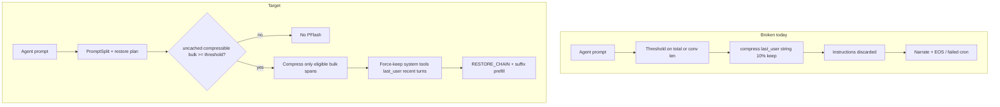

# Agent-safe PFlash architecture

## Problem (why today’s PFlash is wrong)

Tool-split was meant to let PFlash touch conversation while tools stay pinned. Reality in [`_maybe_compress_tool_chat`](lucebox-patch/dflash/scripts/server_tools.py):

1. Compression still shreds **`last_user.content` only** (often the job instructions), then re-templates.
2. `DFLASH_TOOL_SPLIT_COMPRESS_CONV=0` does **not** disable PFlash — it only switches the threshold metric back to full `prompt_len` (worse).
3. Threshold uses total / conversation **length**, not **uncached** tokens after `RESTORE_CHAIN`.
4. System+tools are in the thin pin for KV, but PFlash has **no force-keep mask**; C++ `forced=32` chunks is inadequate.

Incident proof: [docs/feedback-pflash-agent-regression.md](docs/feedback-pflash-agent-regression.md) — only `DFLASH_PREFILL_MODE=off` restored the digest cron.



## Design principles (non-negotiable)

| Segment | PFlash |
|---------|--------|
| Tool schemas / parameters | **Never** compress or rewrite |
| System prompt (in `tool_prefix_ids`) | **Never** compress or rewrite |
| Latest user turn (active instructions) | **Never** compress |
| Latest assistant / open tool round | **Never** compress (need exact tool-call context) |
| Older `role=tool` bodies and older history | **Eligible** when bulk is huge |
| `compress_conversation=false` | **Hard skip** — no compress path at all |

Pooling / live shared FA pages (separate whitepaper) must use the same rule: share key covers full shared head; do not invent a tools-only share key while system varies.

## Target mode: `DFLASH_PREFILL_MODE=agent_safe`

Keep existing `off` / `auto` / `always` for non-agent and experiments. Add **`agent_safe`** as the only mode that may be enabled for Hermes tool traffic.

Behavior of `agent_safe`:

1. **Hard prerequisites:** tool-split enabled + successful `PromptSplit`; else behave as `off`.
2. **Hard skip** if `DFLASH_TOOL_SPLIT_COMPRESS_CONV=0`.
3. **Threshold input** = `uncached_compressible_tokens`, not full prompt:
   - After `ToolSplitOrchestrator` restore plan: subtract restored tool pin + restored thick conv prefix from conversation.
   - Only count tokens inside **eligible bulk spans** (below).
4. **Compress unit** = concatenated eligible bulk text (or daemon with keep-ranges), **not** last_user.
5. **Keep policy:** default keep ≥ `0.50` for agent_safe; plus absolute `DFLASH_PREFILL_MIN_KEEP_TOKENS` (e.g. 2048) so small aux prompts cannot collapse to dozens of tokens.
6. **Reorder pipeline** so plan/restore accounting happens **before** the compress decision:

```text
tokenize → split_request → build_plan (restore hits)
  → measure uncached eligible bulk
  → maybe compress eligible messages only
  → write prompt_bin → RESTORE_CHAIN / prefill
```

## Eligible bulk spans (concrete)

From `req.messages` (OpenAI-shaped), mark:

- **Force-keep always:** all content that tokenizes into `tool_prefix_ids`; entire last `user` message; last message if assistant/tool mid-turn; last `K` messages (config, default K=4).
- **Eligible:** earlier `role=tool` message bodies; earlier assistant content that is not the latest turn; optionally older user turns **except** the latest.

Implementation preference (Python-first, fewer C++ deps):

1. Build `kept_messages` copy of `req.messages`.
2. For each eligible message, run existing `compress_text_via_daemon` on that message’s content only (or one concat with separators if C++ needs a single buffer).
3. Re-`apply_chat_template` → new ids → assert `tool_prefix_ids` unchanged (byte/token equality) or abort compress and fall back to uncompressed.

C++ keep-masks later if multi-call compress cost is too high; not required for v1 correctness.

## Gate fixes (must ship even before re-enable)

In [`server_tools.py`](lucebox-patch/dflash/scripts/server_tools.py) `_maybe_compress_tool_chat`:

- If tools + tool_split and `not conversation_compressible(split)`: **return immediately** (fix Exp1 bug).
- If Laguna / adapter `supports_pflash_on_conversation() is False`: return immediately.
- Log explicit `[pflash] skip reason=...` for telemetry.

Same twin for Anthropic compress path if still live.

## Config defaults (agent host)

| Knob | Production until canary | After canary green |
|------|-------------------------|-------------------|
| `DFLASH_PREFILL_MODE` | `off` | `agent_safe` |
| `DFLASH_TOOL_SPLIT_COMPRESS_CONV` | `0` (or `1` only with agent_safe) | `1` |
| `DFLASH_PREFILL_THRESHOLD` | n/a while off | uncached bulk, start **32768** |
| `DFLASH_PREFILL_KEEP` | n/a | **≥ 0.50** |
| `DFLASH_PREFILL_MIN_KEEP_TOKENS` | new | **2048** |
| `DFLASH_PREFILL_KEEP_RECENT_MESSAGES` | new | **4** |

Update [`scripts/enable-pflash.sh`](scripts/enable-pflash.sh) / any `enable-pflash-agent` helpers: stop advertising keep=0.10 for agents; point at `agent_safe`.

## Telemetry (required for diagnosis)

One log line per compress decision:

```text
[pflash] mode=agent_safe decision=fire|skip reason=...
  prompt=N tool_prefix=T conv=C restored=R uncached_bulk=U
  kept_msgs=... compressed_msgs=... keep=0.50 min_keep=2048
  tool_prefix_unchanged=1
```

Optional: segment class counts (system/tools/conv/bulk) once markers are available.

## Certification gate (do not flip prod before this)

Same digest cron methodology as the feedback doc (`9e2114f61177` or current daily digest):

1. Baseline: `PREFILL_MODE=off` — full completion.
2. Candidate: `agent_safe` + compress_conv=1 — **≥3 consecutive full completions**, no early narrate/EOS, tool-call continuity intact.
3. Compare median warm latency; accept only if not regressing badly vs tool-split-only (doc claimed PFlash off was already competitive).
4. Negative test: force old path (`auto` + last_user compress) still fails — proves gate didn’t regress.

## Doc deliverable

Add [docs/pflash-agent-safe-design.md](docs/pflash-agent-safe-design.md) capturing this architecture; link from [feedback-pflash-agent-regression.md](docs/feedback-pflash-agent-regression.md) and [whitepaper-tools-system-prompt-cache.md](docs/whitepaper-tools-system-prompt-cache.md) §2.1 / PFlash note. Status of production remains **off** until certification green.

## Implementation phases

1. **M0 — Safety gates:** hard skip on `compress_conversation=false`; skip logging; unit tests for gate matrix.
2. **M1 — `agent_safe` + reorder:** restore-aware uncached bulk threshold; never compress last_user; force-keep recent messages; tool_prefix equality check.
3. **M2 — Defaults/scripts/docs:** agent-safe enable script; feedback doc status “fix designed / awaiting canary”.
4. **M3 — Canary on ai.local:** digest A/B; only then set prod `PREFILL_MODE=agent_safe`.

No prod enable in M0–M2.

## Out of scope (explicit)

- Live FA page pooling across `TARGET_CACHE_SLOTS` (separate Phase 4).
- Fixing tools-only fingerprint vs dynamic system (§2.1.1 whitepaper) — related correctness; track as sibling; do not block PFlash gates, but **do not** share compressed KV across mismatched system text.
- Replacing dflash with vLLM APC.
