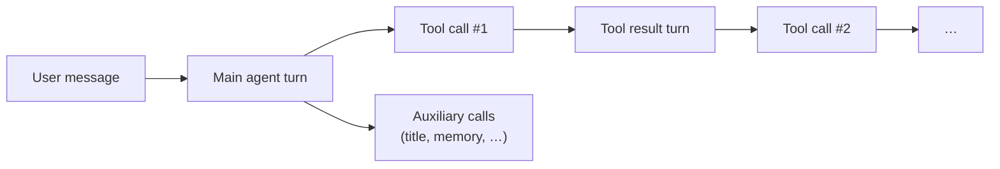
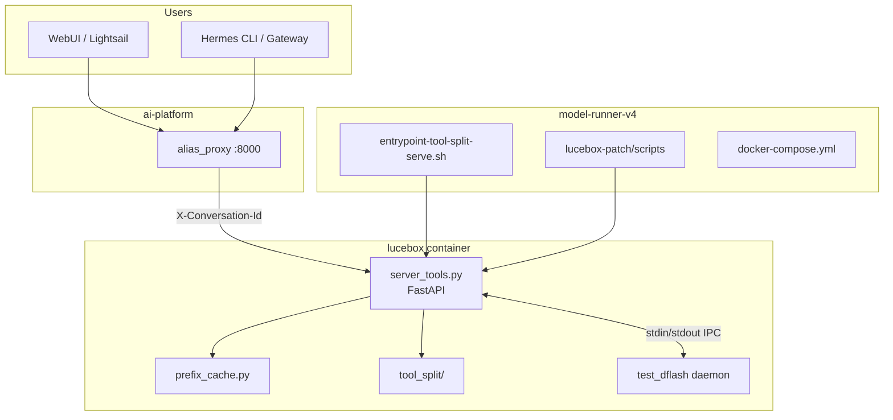
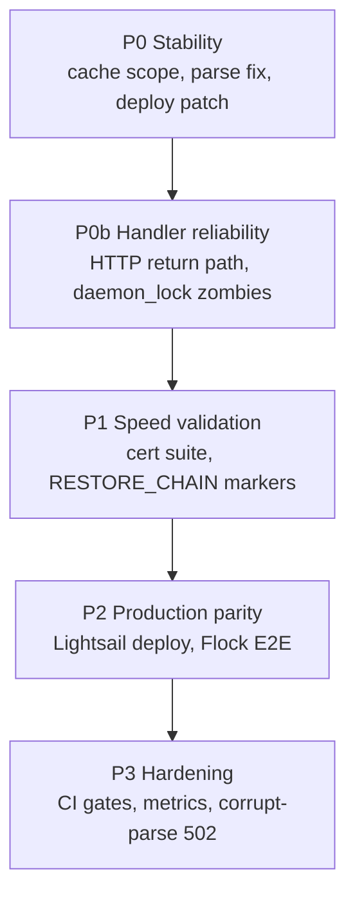

# Agent Inference Program — What We're Trying to Achieve

**Status:** July 2026 · active engineering program  
**Hardware target:** 2× RTX 3090 (24 GB each), 131K context, Qwen3.6-27B Q4_K_M  
**Repos:** `lucebox-hub` (engine), `model-runner-v4` (deploy + certification), `ai-platform` (proxy), `hermes-agent` + `webui` (consumers)

This document is the **program-level view**: why we're doing this work, what
“done” looks like for users, and how the pieces fit together. Tactical deploy
steps and certification gates live in
[engine-certification-plan.md](./engine-certification-plan.md). Architecture
and benchmark claims live in
[whitepaper-agent-inference-cache.md](./whitepaper-agent-inference-cache.md).

---

## 1. North star

**Make Hermes-style agent chat feel interactive on consumer GPUs** — same
model, same 128K context window, but turns that complete in seconds instead of
tens of seconds, with **reliable structured tool calls** on every turn.

A single user message in Hermes is not one model call. It is a burst:



Each arrow is a full inference request with a prompt shaped like:

```
[System prompt] + [Tool schemas] + [Conversation history] + [Latest delta]
```

On stock inference, 70–90% of that prompt is identical to the previous request,
yet the server re-prefills all of it every time. On 2×3090 that costs **30–45 s
per turn** and **7–8 tok/s decode** — unusable for chat.

**Our goal:** warm agent turns (especially after a tool result) at **< 6 s wall
time**, warm prefill at **~0.5 s** for ~8.5K-token prompts, decode at **50+
tok/s**, with **zero empty responses** and **valid `tool_calls` JSON** on every
tool turn.

---

## 2. User-visible outcomes (what “success” feels like)

| Experience | Today (broken / naive) | Target |
|------------|------------------------|--------|
| First reply to “What is Flock camera?” | Empty retries, raw `<function=web>` in chat, or wrong tool | Clean `web` tool call → search → answer |
| Turn after a tool returns | 30–45 s wait, sometimes HumanEval code or 0 tokens | < 6 s, correct continuation |
| Multi-turn session | Cache thrash between benchmark / cron / chat traffic | Stable per-session cache via `X-Conversation-Id` |
| Long sessions (8K+ tokens) | Re-prefill dominates latency | `RESTORE_CHAIN` reuses tool + conversation KV |
| Operator confidence | “Hermes regressed” | Certified numbers from `ai-platform` proxy E2E benches |

**Canonical production repro** (July 2026): WebUI session
`deea23ff-5d7d-4a4b-8504-2d36a423b34e`, prompt *“What is Flock camera?”* —
empty model retries, bare function syntax in content, intermittent recovery.
Hermes had been stable for months; the regression tracks **recent inference
engine changes** (tool-split + prefix cache), not agent logic.

---

## 3. Scope — what we own vs what we don't

### In scope (this program)

| Layer | Responsibility |
|-------|----------------|
| **lucebox-hub** `server_tools.py`, `prefix_cache.py`, `tool_split/` | OpenAI API, tool-parse, cache scoping, `RESTORE_CHAIN` orchestration |
| **test_dflash** daemon | KV cache, snapshot slots, layer-split 27B, speculative decode |
| **model-runner-v4** | Docker compose, entrypoints, patch mount, certification scripts |
| **ai-platform proxy** | Route to lucebox, forward `X-Conversation-Id`, publish certified bench numbers |

### Out of scope (consumers only)

| Layer | Role |
|-------|------|
| **hermes-agent** | Sends chat + tools; retries on empty; dispatches `tool_calls` |
| **webui** | UI; must pass conversation id header on completions |
| **Hermes gateway** | Message routing; not KV cache |

**Rule:** Do not patch Hermes to paper over engine bugs (empty tokens, unparsed
tool syntax in `content`). Fix the engine; keep Hermes as the honest client.

---

## 4. Technical strategy (four pillars)

These are the techniques from the whitepaper. Together they turn agent prompts
from pathological into cache-friendly.

### 4.1 Tool-split KV caching

Split each prompt into:

- **Tool prefix** (~4–6K tokens, static per toolset) → pinned in **thin
  snapshot slots** keyed by schema fingerprint
- **Conversation suffix** (grows each turn) → **thick** prefix-cache slots
  keyed by session scope

First request with a toolset: full prefill + `SNAPSHOT_THIN` to pin tool KV.  
Later requests: `RESTORE_CHAIN` restores thick conv slot + thin tool slot(s),
then prefills only the delta.

### 4.2 Session-scoped prefix cache

**Problem:** Global LRU let benchmark probes, cron jobs, and agent sessions
share slots → `empty prompt`, 0-token responses, wrong decode (HumanEval code).

**Fix:** `resolve_cache_scope()` in `prefix_cache.py`:

- With `X-Conversation-Id`: scope = `session_id:tools_fingerprint_prefix`
- Without: ephemeral scope per prompt hash (no cross-traffic reuse)

See [feedback-prefix-cache-regression.md](./feedback-prefix-cache-regression.md).

### 4.3 Reliable tool-call parsing

Models emit tool syntax in several shapes. The engine must normalize all of
them into OpenAI `tool_calls[]` before returning to Hermes.

| Format | Example | Status |
|--------|---------|--------|
| Wrapped | `<tool_call><function=terminal>…</tool_call>` | Always supported |
| Bare (Flock regression) | `<function=web>…` without wrapper | Fixed in `parse_tool_calls()` |
| Partial / corrupt after bad KV | garbled tokens | Should error/retry, not leak to chat (P3) |

### 4.4 Tuned speculative decode (DFlash)

Profiled telemetry found ~700 ms/step cross-GPU feature copy at 8K+ context.
`DFLASH_DRAFT_FEATURE_MIRROR=1` keeps an F32 mirror on the draft GPU and
raised decode from ~8 tok/s to **50–94 tok/s** depending on context.

PFlash conversation compression stays **off** for agents (`DFLASH_PREFILL_MODE=off`,
`DFLASH_TOOL_SPLIT_COMPRESS_CONV=0`) — it breaks tool-calling. See
[feedback-pflash-agent-regression.md](./feedback-pflash-agent-regression.md).

---

## 5. Target stack configuration

Production and `ai.local` should converge on:

```bash
# model-runner-v4/.env
DFLASH_TOOL_SPLIT_ENABLED=1
DFLASH_PREFILL_MODE=off
DFLASH_TOOL_SPLIT_COMPRESS_CONV=0
DFLASH_LAYER_SPLIT=1
DFLASH_TARGET_DEVICES=cuda:0,cuda:1          # compose / dflash_server
# entrypoint-tool-split-serve.sh maps to --target-gpus 0,1 for test_dflash
DFLASH_DRAFT_FEATURE_MIRROR=1
DFLASH_PREFIX_CACHE_SLOTS=4
DFLASH_TOOL_SPLIT_PINNED_SLOTS=2
```

**Patch mount** (`lucebox-patch/dflash/scripts/`):

```
_prefill_hook.py
prefix_cache.py
server_tools.py
tool_split/
```

**Entrypoint requirements:** `libmtmd.so.0` on `LD_LIBRARY_PATH`; integer GPU
ids for `test_dflash`. Details in [engine-certification-plan.md](./engine-certification-plan.md).

**Client header:** every agent completion should send:

```
X-Conversation-Id: <session-uuid>
```

Forwarded by `ai-platform/services/proxy/alias_proxy.py`.

---

## 6. Architecture (end-to-end)



**Certified benchmarks** run through the same path the proxy uses (not lucebox
direct-only), so published numbers match production.

---

## 7. Measurement — how we prove it

### 7.1 Speed targets (whitepaper)

| Metric | Naive | Target | Certification gate |
|--------|-------|--------|-------------------|
| Warm prefill @ ~8.5K tokens | ~11 s | **≤ 0.5 s** (~20×) | `agent_after_tool_prefill_ms < 500` |
| Wall time after tool result | 30–45 s | **< 6 s** | `agent_after_tool_s < 6.0` |
| Decode throughput | 7–8 tok/s | **51–94 tok/s** | Logged in bench JSON |
| Multi-turn prefill (turn 3 vs 1) | — | **≥ 5×** | `incremental_prefill_speedup` |

### 7.2 Stability targets

| Invariant | Pass criteria |
|-----------|---------------|
| No cache pollution | Benchmark → agent tool turn: `completion_tokens > 0`, no `empty prompt` |
| Cross-session isolation | Unrelated session: no 503, no memorized benchmark text |
| Tool parse | Bare + wrapped function syntax → `tool_calls[]` |
| Snapshot protocol | `RESTORE_CHAIN` + `inline-snap committed` in logs; zero `inline snap failed` |
| Daemon health | `/health` → `{"status":"ok"}` |

### 7.3 Certification runner

One command on `ai.local` (or any `ai-inference` host):

```bash
cd /media/data/projects/model-runner-v4
PROXY_URL=http://ai-platform-proxy:8000 \
  bash scripts/run-engine-certification.sh
```

Phases:

1. **Unit** — `test_prefix_cache_slot_depth.py`, `test_parse_tool_calls.py` (12 tests)
2. **Pollution E2E** — `test_cache_pollution.py`
3. **Thorough bench** — `benchmark-tool-split-thorough.py` (10 checks + JSON artifact)

**ai-platform is the source of truth** for E2E benchmark numbers published
externally; lucebox-direct is for debugging only.

---

## 8. Workstreams and priority



### P0 — Stability fixes (implemented in repo; deploy in progress)

| Item | Purpose |
|------|---------|
| Session-scoped `resolve_cache_scope()` | Stop benchmark/agent KV pollution |
| Bare `<function=` parser | Fix Flock-style raw syntax in `content` |
| Full patch deploy (`_prefill_hook`, `tool_split/`, …) | Tool-split path actually starts |
| `libmtmd` + `--target-gpus 0,1` in entrypoint | Daemon stays alive |

### P0b — Handler reliability (active investigation)

Observed on `ai.local` July 2026 — **not** slow inference:

- Daemon completes tool prompts in **~3 s** (`ok N=271`, prefill ~1.3 s)
- HTTP clients still **time out** (60–180 s) with no response body
- Follow-on requests log `cache scope=…` then **stall** (likely `daemon_lock` held by zombie handlers)
- `prepare_request_context failed:` (empty) on live proxy traffic — needs proper exception logging; likely `CancelledError` on client disconnect

**This blocks certification and production sign-off.** Longer client timeouts
do not fix it.

### P1 — Speed validation

- Run full `run-engine-certification.sh`; archive JSON under `bench-results/`
- Confirm `RESTORE_CHAIN` and `tool KV pinned` on warm tool turns
- Match whitepaper gates on `ai.local`, then through proxy

### P2 — Production parity

- Deploy patch + env to Lightsail inference stack
- Re-run Flock camera WebUI E2E
- 24h log watch: `empty prompt`, `inline snap failed`

### P3 — Hardening

- Don't leak corrupt tool markup; return 502 + retry hint
- Proxy metric: `completion_tokens=0` rate
- CI: unit + pollution tests on `server_tools.py` / `prefix_cache.py` changes

---

## 9. Current status (honest snapshot)

| Area | State |
|------|--------|
| Unit tests (prefix cache + parse) | **12/12 pass** in lucebox container |
| `ai.local` lucebox health | **Healthy** with `tool-split=1`, layer-split |
| Simple text completion (no tools) | **Works** (~0.3 s prefill, ~13 tok/s decode) |
| Tool completions via HTTP | **Unreliable** — daemon often finishes; client times out |
| `RESTORE_CHAIN` / `SNAPSHOT_THIN` on live traffic | **Not observed yet** on failing runs |
| Pollution / thorough certification | **Blocked** on handler hang |
| Lightsail production | **Not updated** with full patch |
| Hermes / WebUI code | **No changes required** for root cause |

**Rollback** if needed: `DFLASH_TOOL_SPLIT_ENABLED=0` → legacy `dflash_server`
path (slower but was stable for months before scoped-cache work).

---

## 10. Sign-off checklist

Program is **done** when all of the following are true:

- [ ] `run-engine-certification.sh` exits 0 through **proxy** URL
- [ ] Unit tests 12/12; pollution test passes
- [ ] `agent_after_tool_s < 6`, `agent_after_tool_prefill_ms < 500` on certified bench
- [ ] WebUI Flock prompt → structured `web` tool call, no empty retries
- [ ] 30-minute agent session: no `empty prompt` in lucebox logs
- [ ] Warm tool turn logs show `RESTORE_CHAIN` and `tool KV pinned`
- [ ] Lightsail production matches `ai.local` patch + env
- [ ] Certified numbers documented from proxy E2E (not hand-waved)

---

## 11. Related documents

| Document | Contents |
|----------|----------|
| [whitepaper-agent-inference-cache.md](./whitepaper-agent-inference-cache.md) | Architecture deep-dive + benchmark claims |
| [engine-certification-plan.md](./engine-certification-plan.md) | Deploy checklist, gates, rollback |
| [feedback-prefix-cache-regression.md](./feedback-prefix-cache-regression.md) | Cache pollution root cause + fix |
| [feedback-pflash-agent-regression.md](./feedback-pflash-agent-regression.md) | Why PFlash stays off for agents |
| [deployment-flow.md](./deployment-flow.md) | How patches reach `ai.local` |
| [deployment-sop.md](./deployment-sop.md) | Git-as-source-of-truth ops |

**Scripts:**

| Script | Role |
|--------|------|
| `scripts/run-engine-certification.sh` | Full cert pipeline |
| `scripts/test_cache_pollution.py` | Benchmark → agent isolation test |
| `scripts/benchmark-tool-split-thorough.py` | Speed + stability gates |

---

## 12. One-paragraph summary

We are building and certifying a **tool-split, session-scoped KV cache** for
Qwen3.6-27B on 2×3090 so Hermes agents get **fast, reliable tool-calling** at
128K context. The engine (`lucebox-hub` + `test_dflash`) must return valid
`tool_calls` every turn, never serve stale benchmark KV to agent sessions, and
hit **sub-second warm prefill** and **sub-6-second post-tool turns** as
measured through the **ai-platform proxy**. Hermes and WebUI are consumers,
not the fix surface. Stability patches are in the repo; **HTTP handler
reliability** (responses not returning after daemon `ok`) is the current
blocker before speed certification and Lightsail production deploy.
