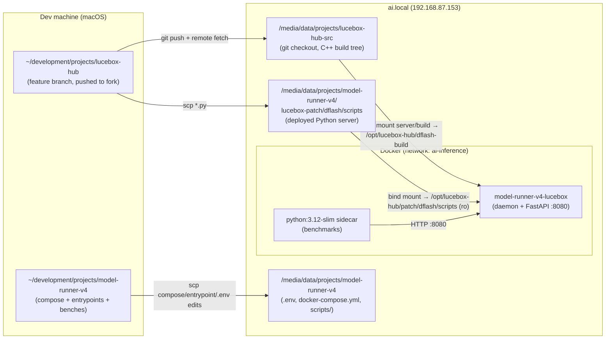
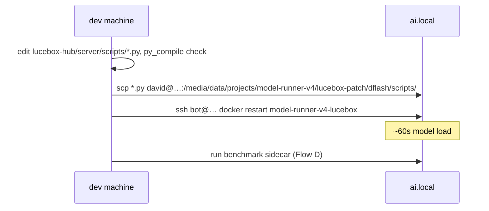
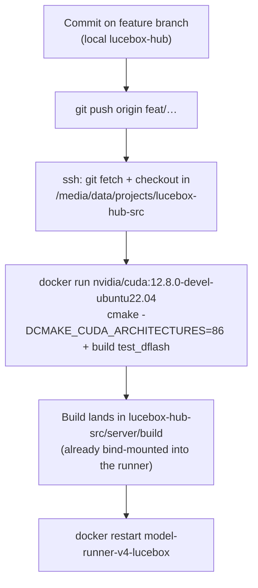

# Deployment Flow: lucebox-hub → ai.local Model Runner

How changes travel from the local development machine to the production
model runner on `ai.local` (192.168.87.153, 2×RTX 3090), and how they are
verified. Everything runs in Docker on the remote host; nothing is executed
in the remote host's bare environment beyond `docker` and file sync.

**SOP:** Git remote is the single source of truth — see
[deployment-sop.md](./deployment-sop.md). Do not `scp` or hand-edit source
on ai.local; commit, push, then `git pull` on the host.

## Topology



Two remote users, one host:

| User | Purpose |
|---|---|
| `bot@192.168.87.153` | Read-only ops: `docker logs`, `docker run` sidecars, `nvidia-smi`, scp to `/tmp` |
| `david@192.168.87.153` | Writes under `/media/data/projects/*` and `docker compose` lifecycle |

## Container Mounts (what the runner actually executes)

From `docker inspect model-runner-v4-lucebox`:

| Host path | Container path | Role |
|---|---|---|
| `model-runner-v4/lucebox-patch/dflash/scripts` | `/opt/lucebox-hub/patch/dflash/scripts` (ro) | **Live Python server** — `server_tools.py`, `prefix_cache.py`, `tool_split/` |
| `lucebox-hub-src/server/build` | `/opt/lucebox-hub/dflash-build` (ro) | **Compiled daemon** — `test_dflash` + patched ggml `.so`s |
| `models-cache` | `/opt/lucebox-hub/server/models` (rw) | GGUF weights (target, draft, PFlash drafter) |
| `model-runner-v4/scripts/entrypoint-*.sh` | `/scripts/…` (ro) | Entrypoints |

Key consequence: **Python changes need only an scp + container restart;
C++ changes need a remote rebuild.**

## Flow A — Python server change (seconds)



```bash
python3 -m py_compile server/scripts/prefix_cache.py server/scripts/server_tools.py
scp server/scripts/{prefix_cache,server_tools}.py \
    david@192.168.87.153:/media/data/projects/model-runner-v4/lucebox-patch/dflash/scripts/
ssh bot@192.168.87.153 "docker restart model-runner-v4-lucebox"
```

## Flow B — C++ daemon change (minutes)

The daemon is built **on the remote host inside a CUDA devel container**
(never on the dev machine — wrong arch, no CUDA):



Gotcha (hit once, fixed in the entrypoint): the freshly built binary's
RUNPATH points at the *build container's* `/src` path. The entrypoint
prepends the mounted build tree's ggml directories to `LD_LIBRARY_PATH` so
the patched `libggml*.so` wins over any stock copy — otherwise the daemon
dies at startup with `undefined symbol` errors.

## Flow C — Config change (.env / compose / entrypoint)

Runtime knobs live in `/media/data/projects/model-runner-v4/.env` on the
host; `docker-compose.yml` passes them through with defaults; the entrypoint
(`scripts/entrypoint-tool-split-serve.sh`) translates them into
`server_tools.py` arguments and daemon environment.

```bash
# edit knob remotely
ssh david@192.168.87.153 \
  "cd /media/data/projects/model-runner-v4 && sed -i 's/^DFLASH_DDTREE_BUDGET=.*/DFLASH_DDTREE_BUDGET=22/' .env"

# compose/entrypoint edits are made locally, then synced
scp docker-compose.yml scripts/entrypoint-tool-split-serve.sh \
    david@192.168.87.153:/media/data/projects/model-runner-v4/…

# recreate (plain `up -d` won't reread .env into a running container)
ssh david@192.168.87.153 \
  "cd /media/data/projects/model-runner-v4 && docker compose --profile serve up -d --force-recreate"
```

Note the `--profile serve` — the compose file gates the runner behind a
profile, so a bare `docker compose up` reports "no service selected".

Current production knobs (post-tuning):

```
DFLASH_MAX_CTX=131072          DFLASH_PREFIX_CACHE_SLOTS=4
DFLASH_TOOL_SPLIT_ENABLED=1    DFLASH_TOOL_SPLIT_PINNED_SLOTS=2
DFLASH_PREFILL_CACHE_SLOTS=2   DFLASH_PREFILL_THRESHOLD=16384
DFLASH_DRAFT_GPU=0             DFLASH27B_DRAFT_CTX_MAX=2048
DFLASH_DDTREE_BUDGET=22        DFLASH_DRAFT_FEATURE_MIRROR=0
DFLASH27B_FA_WINDOW=0          DFLASH_LAYER_SPLIT=0
DFLASH_LEGACY_DAEMON=1 (set by entrypoint)
```

## Flow D — Verification (every deploy)

The API is only reachable inside the `ai-inference` Docker network, so
benchmarks run as a throwaway sidecar container on that network. Scripts are
scp'd to `/tmp` and mounted read-only (editing in place fails with
"Device or resource busy").

```bash
scp scripts/decode_bench.py bot@192.168.87.153:/tmp/decode_bench.py
ssh bot@192.168.87.153 \
  "docker run --rm --network ai-inference \
     -v /tmp/decode_bench.py:/tmp/b.py:ro python:3.12-slim python /tmp/b.py"
```

Standard checks, in order:

1. **Startup config echo** — `docker logs … | grep 'cfg]'` must show the
   intended `budget/draft_ctx_max/mirror/gpu` values (catches env vars that
   didn't reach the daemon).
2. **`scripts/decode_bench.py`** — decode TPS + draft acceptance across
   0.5k/2k/8k/16k/24k prompts. Regressions show up as `decode_tps` drops or
   `step_ms_*` spikes in `usage.timings`.
3. **`/tmp/tool_cache_test.py`** — 3-turn Hermes-shaped tool session; warm
   turns must show `prefix_len` in timings and ~0.5s prefill.
4. **`scripts/pflash_stress.py`** — one >16,384-token request; logs must
   show `[compress] … kept=…` then `[unpark] target restored` with no OOM.
5. **VRAM watermark** — `nvidia-smi`; GPU0 ≈ 21GB steady, GPU1 idle.

## Rollback

Every layer is independently revertible:

| Layer | Rollback |
|---|---|
| Python server | `git checkout <prev> -- server/scripts/…` locally, re-scp, restart |
| Daemon binary | `git checkout <prev>` in `lucebox-hub-src`, rebuild (or keep the old `server/build` dir aside before rebuilding) |
| Config | edit `.env`, `docker compose --profile serve up -d --force-recreate` |
| Everything | compose still defaults to the stock GHCR image path when the tool-split entrypoint is disabled (`DFLASH_TOOL_SPLIT_ENABLED=0`) |
