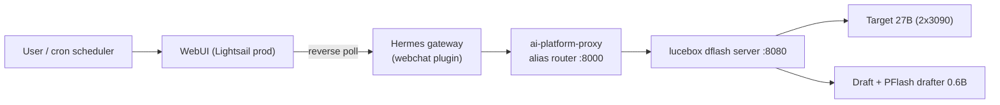
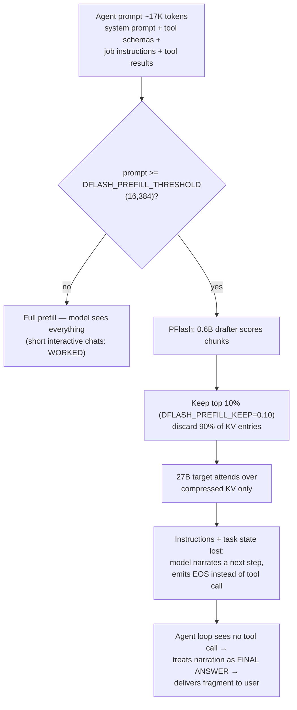
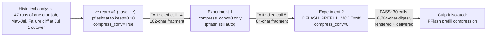

# Feedback: PFlash Prefill Compression Breaks Agentic Workloads

**Date:** July 4, 2026
**Reporter:** David Roth (Hermes Agent deployment on `ai.local`, 2×RTX 3090)
**Stack:** `model-runner-v4` lucebox / dflash tool-split server (`feat/tool-split-agent-cache`)
**Severity:** Critical for agent workloads — 100% task-failure rate while enabled
**Status:** Confirmed by controlled A/B test; workaround deployed (`DFLASH_PREFILL_MODE=off`)

---

## 1. Summary (plain-language overview)

We run a personal AI assistant (Hermes Agent) that does multi-step jobs on its
own — for example, a daily job that browses news sites, collects stories, and
writes a formatted news digest. To do this, the assistant calls the language
model many times in a row: each call reads the whole conversation so far,
decides on the next step (like "open this website"), gets the result back, and
continues until the job is done.

On July 1 we switched our model server to the new Lucebox "dflash" engine,
which uses several clever caching tricks to make a big model fast on consumer
graphics cards. Starting that same day, **every single scheduled job began
failing in the same strange way**: the assistant would work normally for a few
steps, then suddenly announce what it planned to do next — something like
*"Let me gather more details from the actual news sources"* — and just stop.
No error, no crash. It simply quit mid-task, and that half-sentence got
delivered to the user as if it were the finished report.

The root cause is a feature called **PFlash prefill compression**. To save
time on long prompts, a small helper model scans the incoming prompt and keeps
only the 10% of it that it judges most important, throwing away the rest
before the main model ever sees it. That works acceptably for one-shot
questions, but our agent's prompts start at about 17,000 tokens — just over
the 16,384-token threshold where compression kicks in. So on **the very first
call of every job**, the model lost roughly 90% of its instructions and
context, including the parts that said "keep working until the digest is
complete." A model that can't remember its instructions behaves exactly like
what we saw: it improvises a plausible-sounding next step, then stops.

We proved this with a controlled experiment. With compression on, the job
failed 7 out of 7 times over four days. We then turned off only the
conversation-compression flag — still failed. Then we turned off PFlash
prefill compression entirely — and the same job immediately ran to
completion: 30 model calls, a full 6,700-character digest, correctly rendered
and delivered. Speed was essentially unchanged, because the tool-split KV
cache (the main speed feature) kept working and the compression step itself
had been costing time too.

**Bottom line:** the lossy 10:1 prompt compression destroys agent reliability
while providing little measured speed benefit on this workload. We recommend
it never silently discard system instructions, and that agent deployments
default to `DFLASH_PREFILL_MODE=off`.

---

## 2. Environment

| Component | Detail |
|---|---|
| Server | `model-runner-v4-lucebox` container, Luce DFlash OpenAI server (tool-aware) |
| Target model | `Qwen3.6-27B-Q4_K_M.gguf` (`qwen3.6-27b-autoround` alias) |
| Draft / PFlash drafter | `dflash-draft-3.6-q4_k_m.gguf` / `Qwen3-0.6B-BF16.gguf` |
| Hardware | 2× RTX 3090 (24 GB each), `DFLASH_TARGET_DEVICES=cuda:0,cuda:1` |
| Context | `DFLASH_MAX_CTX=131072`, `DFLASH27B_KV_TQ3=1` (3-bit KV quant) |
| Caching | tool-split on, `pinned_slots=2`, prefix-cache 4 slots, PFlash full-cache 2 slots |
| PFlash config at failure | `DFLASH_PREFILL_MODE=auto`, `DFLASH_PREFILL_THRESHOLD=16384`, `DFLASH_PREFILL_KEEP=0.10`, `DFLASH_TOOL_SPLIT_COMPRESS_CONV=1` |
| Client | Hermes Agent gateway (OpenAI chat-completions, non-streaming tool loop) |
| Fronting | `ai-platform-proxy` (alias router) → lucebox `:8080` |

The previous stack (until June 29) was a llama.cpp-style server running
`Qwen3.5-35B-A3B` GGUF with no KV compression.

## 3. The request path



Every agent turn fans out into several `/v1/chat/completions` calls: main
loop, tool-result continuations, and auxiliary calls (titles, delegation,
memory). The main-loop prompts for the failing cron job start at **~17.0K
tokens** (system prompt + tool schemas + job instructions) and grow toward
60K+ as tool results accumulate.

## 4. Observed failure

### 4.1 Symptom

Agent runs proceed normally for 1–14 tool-calling iterations, then the model
returns a short free-text message *describing its next intended action* and
stops emitting tool calls (`finish_reason=stop`). The agent framework
correctly interprets a no-tool-call response as the final answer and delivers
the fragment. Example delivered "digest":

> *"Now let me get a few more stories — the Kling AI funding, Alibaba ban, and
> the Chinese AI model story."*

### 4.2 Failure-rate cliff at the stack cutover

Response length of the same daily cron job ("Daily AI News Digest",
identical prompt throughout):

| Date | Backend | Final response | Outcome |
|---|---|---|---|
| Jun 26 | llama.cpp 35B | 2,560 chars | full digest |
| Jun 27 | llama.cpp 35B | 2,944 chars | full digest |
| Jun 28 | llama.cpp 35B | 3,791 chars | full digest |
| Jun 29 | llama.cpp 35B | 3,470 chars | full digest |
| **Jul 1** | **lucebox dflash** | 101 chars | mid-task fragment |
| Jul 2 (×2) | lucebox dflash | 170 / 149 chars | mid-task fragments |
| Jul 3 | lucebox dflash | 68 chars | mid-task fragment |
| Jul 4 (×3) | lucebox dflash | 192 / 120 / 102 chars | mid-task fragments |

7-for-7 failures after the cutover; zero occurrences of this failure mode
before it (prior failures were network timeouts, a different signature).

### 4.3 Per-call signature while broken

From the live reproduction (session `cron_9e2114f61177_20260704_151323`):

- Prompt sizes 17,082 → 33,432 tokens across 14 calls.
- **Output per call: 24–89 tokens** — barely enough for one tool call or one
  sentence.
- Call #14: `in=33432 out=24 latency=110.1s` → 24 tokens of narration + EOS.

Server log correlation shows PFlash compressing during these runs:

```
[drafter] score_and_compress total 2.02s S=21512 kept=2120 (67/673 chunks, forced=32)
  [daemon] [compress] 21512 -> 2120 tokens (keep_ratio=0.100)
```

A 21,512-token prompt reduced to 2,120 tokens of surviving KV — a 90%
discard decided by a 0.6B drafter, including (evidently) the job
instructions and output-format specification.

## 5. Root-cause mechanism



Two properties of agent workloads make this much worse than for one-shot
chat:

1. **The threshold sits below the agent's floor.** Our smallest main-loop
   prompt (~17K) is already over 16,384, so *every* call of *every* job is
   compressed — there is no uncompressed warm-up turn.
2. **The discarded content is load-bearing.** In agent prompts, "importance"
   is not concentrated in 10% of the tokens. The output format spec, the
   completion criteria ("do not stop until the digest is delivered"), and the
   accumulated tool results are all required. A relevance-scoring drafter has
   no way to know that the one sentence forbidding early exit matters more
   than a paragraph of news text.

Interactive chats stayed healthy the whole time because they sit far below
the threshold — which made the failure look "random" from the outside (chat
works, cron fails).

## 6. Tests performed



Methodology notes:

- All three live runs were triggered the same way: a message to the
  production WebUI asking the agent to run cron job `9e2114f61177`
  immediately. Same job, same prompt, same model, same day (July 4), within
  a 3-hour window — the only variable was the engine's compression config.
- The engine was recreated (`docker compose up -d lucebox`) between runs and
  its startup banner checked to confirm the effective config
  (`pflash = auto/off`, `compress_conv = True/False`).
- Agent-side telemetry (per-call `in`/`out` tokens, latency, turn-end reason)
  came from Hermes `agent.log`; engine-side compression events
  (`score_and_compress`, `[compress] N -> M tokens`) from the lucebox
  container log; the two were correlated by timestamp.
- A pre-change checkpoint (env, compose file, container inspect, image ID,
  log tail) was snapshotted to
  `.checkpoints/20260704_160010-pre-compress-off/` for exact rollback.

### The decisive A/B, same job, same day

| | Baseline 15:13 | Exp 1 16:04 | Exp 2 16:18 |
|---|---|---|---|
| `DFLASH_PREFILL_MODE` | auto | auto | **off** |
| `DFLASH_TOOL_SPLIT_COMPRESS_CONV` | 1 | 0 | 0 |
| API calls completed | 14 | 5 | 30 |
| Median output/call | ~26 tokens | ~129 tokens | ~520 tokens |
| Final response | 102 chars (fragment) | 84 chars (fragment) | **6,704 chars (full digest)** |
| Delivered artifact | none | none | text digest + rendered briefing |

Experiment 1 is important: disabling only the tool-split conversation
compression did **not** fix the failure, which isolates the prefill
compression path (`--prefill-compression auto`) as the necessary and
sufficient cause.

## 7. Performance impact of disabling PFlash

Measured end-to-end call latency (Hermes-side, includes network + proxy) on
the same workload:

| Metric | PFlash on (broken runs) | PFlash off (fixed run) |
|---|---|---|
| Cold first call, ~17K prompt | 12–116s (varied w/ cache state) | 44.5s |
| Warm mid-run calls, 20–40K prompt | 13–165s | 18–91s |
| Warm calls, 40–60K prompt | n/a (never survived this far) | 39–92s |
| Long generation (3.5K tokens out, ~60K ctx) | n/a | 250–298s (~13 tok/s incl. prefill) |
| Task completion rate | **0/7** | **1/1 (and counting)** |

Key observations:

- **No measurable regression from turning PFlash off.** Warm-turn latency is
  dominated by the tool-split prefix cache (`RESTORE_CHAIN`), which remains
  enabled and hit on essentially every call (`[pc] lookup hit slot=N
  prefix_len=...` throughout the fixed run). PFlash's savings were partially
  offset by its own overhead anyway: drafter load + `score_and_compress`
  (0.1–2.0s) plus target park/unpark cycles on each compressed prefill.
- Comparable calls were sometimes *faster* with PFlash off, e.g. ~36K-token
  prompts: 232.5s (on, `out=41`) vs 35.5s (off, `out=314`).
- The fixed run pushed context to 67K tokens (past the agent's own
  compression trigger) with no engine instability, at TQ3 KV quantization.
- Tokens-of-useful-work per wall-clock hour is the metric that actually
  matters for agents, and it went from ~0 (job never completes, retries
  daily) to one full completion in 38 minutes.

## 8. Secondary findings

1. **PFlash full-cache temp-file race.** With PFlash enabled, the engine
   logs recurring failures persisting compressed caches:

   ```
   [pc] full-cache: failed to copy cur_bin (/tmp/tmpXXXX.bin ->
   /tmp/dflash-pflash-cache/<fp>.bin): [Errno 2] No such file or directory
   ```

   The `NamedTemporaryFile` appears to be deleted (context exit / delete=True)
   before the copy into the cache directory happens. Independent of the
   quality issue, the full-prompt PFlash cache likely never persists.

2. **Small-segment compression is near-total.** Auxiliary calls show
   `601 -> 25 tokens` compressions — a 601-token segment reduced to 25.
   Whatever unit the conversation-segment path compresses, a 0.1 keep-ratio
   floor with no minimum absolute size produces degenerate results on small
   inputs.

3. **`compress_conv=True` is on by default in the compose file**
   (`DFLASH_TOOL_SPLIT_COMPRESS_CONV: ${...:-1}`) even though tool-split is
   explicitly marketed for agent workloads, where conversation KV carries
   the task state.

4. **Tool-split restores are not reported in `usage.timings`.** `_build_usage()`
   only emits `prefix_len` from the conversation prefix-cache lookup
   (`conv_prefix_len`). When a request is served via
   `[tool-split] RESTORE_CHAIN` with a conversation-cache miss (e.g. the first
   turn of a new session), 15–20k tokens of system/tool KV are restored from
   pinned slots but the response reports no cached tokens at all. Downstream
   consumers see e.g. 22,793 prompt tokens prefilled in 4.5s with zero
   reported cache — a physically impossible 5,000+ t/s. Suggest reporting the
   total restored token count (thick conv slot + thin tool slots) in a
   `prefix_len`-style field so clients can separate cache restore from real
   prefill compute.

## 9. Recommendations to the Lucebox team

1. **Never lossily compress system/instruction segments.** The chat-marker
   parser already locates the system sequence (`[pc] chat markers: family=qwen
   sys_seq=...`); the system prompt, tool schemas, and the most recent N
   messages should be force-kept regardless of drafter scores. `forced=32` of
   673 chunks is far too little protection.
2. **Make `keep=0.10` unreachable by accident for agents.** Either raise the
   default (0.5+), scale keep-ratio with prompt size, or gate compression on
   prompt *family* (compress bulk tool output, never the instruction frame).
3. **Reconsider threshold semantics.** A fixed 16,384 threshold sits below
   the standing prompt size of a tool-calling agent, so "auto" means "always"
   for exactly the workload the tool-split feature targets. Consider
   thresholding on the *delta* beyond the cached prefix instead of total
   prompt length — with the prefix cache hitting, the uncached suffix is
   usually small.
4. **Ship an agent preset with prefill compression off.** The tool-split +
   RESTORE_CHAIN + right-sized snapshot machinery delivered its promised
   speedups in our test *without* PFlash; that's the safe default for
   agent traffic. (`enable-pflash-agent.sh` currently sets
   `DFLASH_PREFILL_KEEP 0.10` — the opposite.)
5. **Fix the full-cache temp-file race** (Section 8.1).
6. **Add a quality canary.** A one-line log of drafter-kept token counts per
   segment class (system / tools / conversation) would have made this
   diagnosable from the server log alone.

## 10. Current deployment state and rollback

- Active config (`/media/data/projects/model-runner-v4/.env` on ai.local):
  `DFLASH_PREFILL_MODE=off`, `DFLASH_TOOL_SPLIT_COMPRESS_CONV=0`. All other
  features (tool-split, prefix cache, TQ3 KV, speculative decoding) unchanged.
- Exact pre-change state is checkpointed at
  `.checkpoints/20260704_160010-pre-compress-off/` (env, compose,
  `docker inspect`, image ID, git SHA, log tail, checksums), mirrored to the
  workstation. Rollback = `cp .checkpoints/.../env .env && docker compose up
  -d lucebox`.
