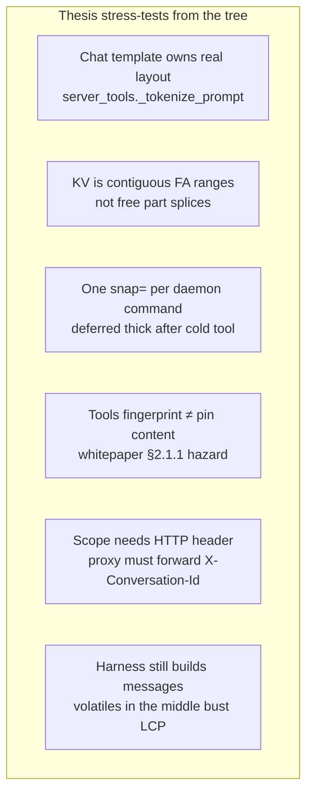
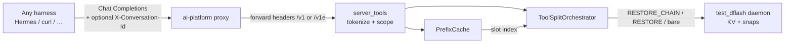
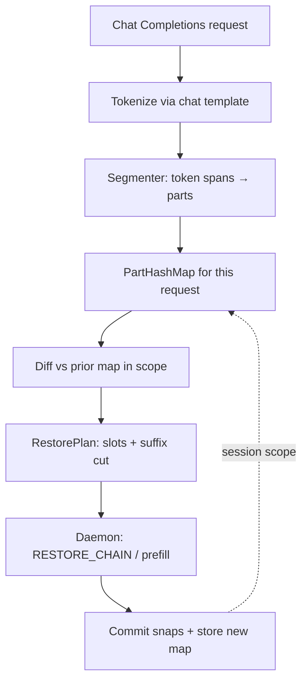
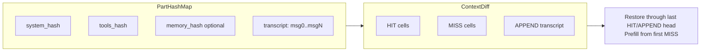
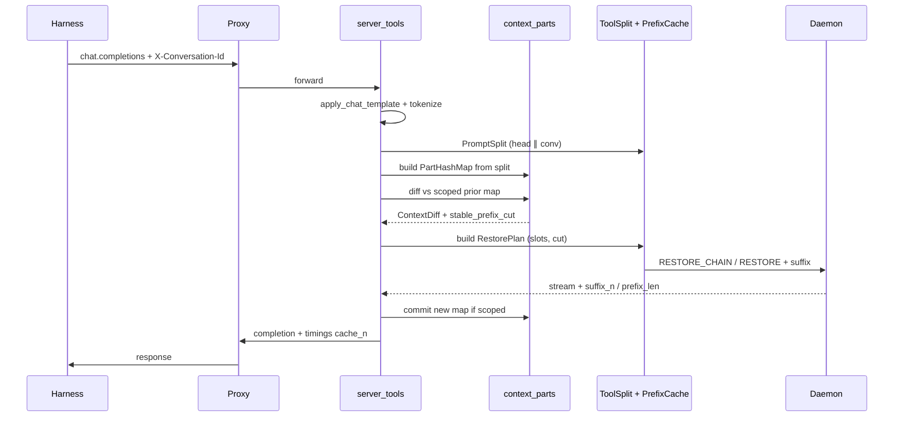
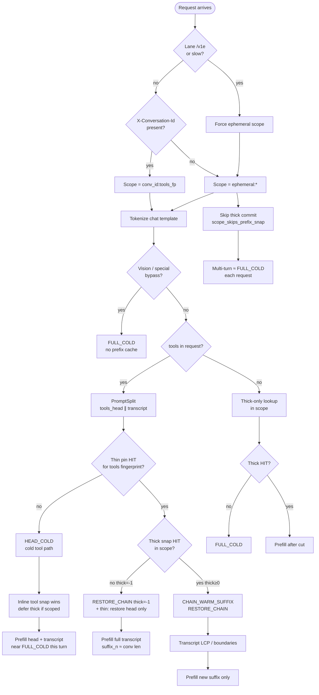
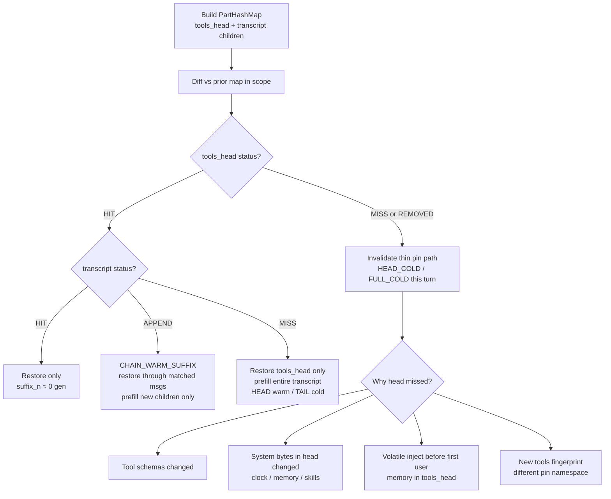
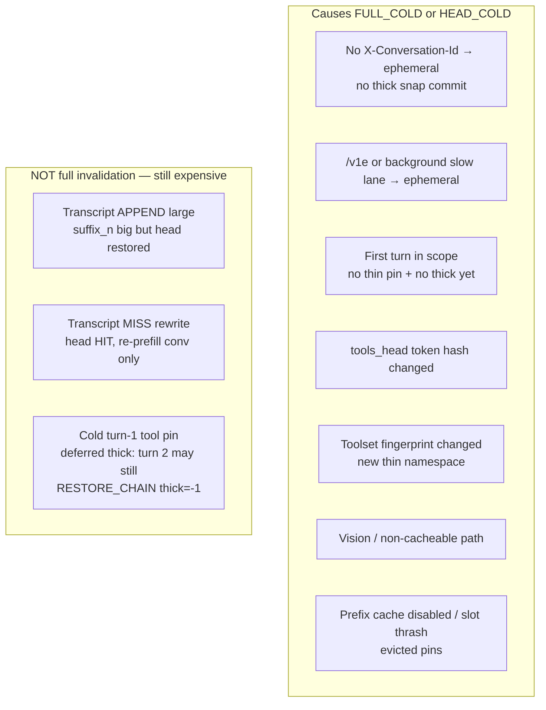
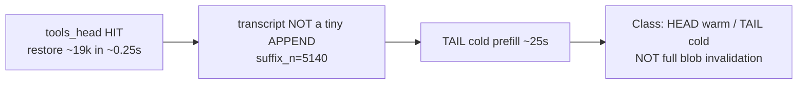

# Heterogeneous Context Cache — Comprehensive Plan

**Status:** Planning (not implementation)  
**Home:** Engine stack (`model-runner-v4` / lucebox) — harness-agnostic  
**Related:** [agent-inference-program.md](./agent-inference-program.md),
[whitepaper-tools-system-prompt-cache.md](./whitepaper-tools-system-prompt-cache.md),
[inference-engine-north-star.md](./inference-engine-north-star.md),
[prefill-suffix-first-plan.md](./prefill-suffix-first-plan.md)

---

## 1. Goal

Stop treating each chat-completions prompt as one opaque blob for caching
purposes. Treat it as a **heterogeneous, ordered sequence of parts**:

1. Break the rendered prompt into parts (with optional sub-parts).
2. Build a **hash map** (`part_id → content_hash`, nested maps where useful).
3. **Diff** against the previous turn’s map for the same conversation scope
   **before** prefill.
4. Restore only what still matches; prefill only the **volatile suffix**
   (and any true misses).

**Non-goals**

- Shrinking `n_ctx` / context capacity (forbidden product invariant).
- Freeform “jigsaw” KV: reuse arbitrary mid-prompt islands out of order.
- Putting the authoritative cache brain in Hermes or any single harness.
- Replacing the proxy’s routing / timings / admission roles.

**Product invariant:** context capacity only grows; we optimize reuse and
layout, never by cutting the window.

---

## 2. Thesis (and how the codebase challenges it)

### Thesis

> Do this **totally in the engine path** (lucebox Python orchestration +
> daemon KV), not in Hermes and not as a proxy-owned prompt rewriter.
> Any harness that speaks Chat Completions + `X-Conversation-Id` benefits.

### What the codebase already proves

The engine stack **already** implements a weaker form of the same idea:

| Existing mechanism | Location | Meaning |
|--------------------|----------|---------|
| `PromptSplit` = `tool_prefix_ids ∥ conversation_ids` | `tool_split/base.py` | Two-part heterogeneous prompt |
| Thin tool pin + thick conv snap | `PrefixCache`, `ToolSplitOrchestrator` | Separate cache cells |
| `RESTORE_CHAIN` + suffix prefill | daemon + `server_tools._compose_daemon_cmd` | Diff-ish: restore head, prefill tail |
| Multi-boundary thick lookup | `find_all_boundaries_markers` / `PrefixCache.lookup` | Longest matching role-boundary cut |
| Session scope | `resolve_cache_scope` | Conversation-isolated hash namespaces |

So we are **extending** tool-split + prefix cache, not inventing caching from
scratch.

### Challenges to “all in the engine” (must design for these)



1. **Token truth lives after `apply_chat_template`.** Hashing OpenAI JSON in
   the proxy can disagree with KV keys. Authoritative hashes = **token ids**
   (or hashes of id spans) inside lucebox after tokenize.
2. **Contiguous live KV.** Safe reuse today is “identical token prefix →
   restore → prefill suffix,” plus thin/thick chain merge. Mid-prompt
   “replace system, keep tools” is **not** free without paged shared-prefix
   work (whitepaper §2.2 — proposed, not shipped).
3. **Python already owns the index; daemon owns tensors.** Moving the hash
   map into C++ without owning templates duplicates Jinja. Keep the part
   hash map in **lucebox Python** next to `PrefixCache` / `ToolSplitOrchestrator`.
4. **Fingerprint/pin mismatch** (tools-only key, system-inclusive thin pin)
   is a live correctness hazard. A part hash map **must key what is pinned**.
5. **Conversation identity is a wire concern.** Without `X-Conversation-Id`,
   traffic is `ephemeral:` and thick snaps are skipped
   (`scope_skips_prefix_snap`). Proxy/harness must still cooperate.
6. **Harness placement still matters.** If memory is injected between tools
   and the first user turn, the thin pin or LCP breaks even with a perfect
   engine. Document a **volatile-suffix convention**; do not require Hermes
   core ownership.

**Revised thesis (survives challenge):**

> Authoritative part hash map + pre-prefill diff live in **lucebox** (engine
> API process). Daemon executes restore/prefill. Proxy stays thin (headers,
> lanes, timings). Harnesses follow a small wire/docs convention. No harness
> owns the innovation.

---

## 3. Current architecture (understanding diagram)



**Today’s mental model of a prompt (already in whitepaper):**

```text
[ system + tool schemas ][ conversation + latest turn ]
        thin pin (≈)              thick / suffix
```

Not yet: system vs tools vs memory vs messages as separately hashed cells
with an explicit diff record.

---

## 4. Target architecture





---

## 5. Part model (engine-native)

### 5.1 Top-level parts (v1)

Derived **after** tokenization from template markers + tool-split boundary
(existing Qwen adapter), not from Hermes types:

| Part ID | How detected (v1) | Typical stability |
|---------|-------------------|-------------------|
| `tools_head` | `PromptSplit.tool_prefix_ids` (today: system+tools before first user) | High if harness keeps system stable |
| `transcript` | `PromptSplit.conversation_ids` | Append-heavy |
| _(optional later)_ `system` / `tools` | Split head when template allows clean cut | Fixes §2.1.1 |

Nested under `transcript`:

| Child key | Meaning |
|-----------|---------|
| `"0".."N"` | Per message / per role-boundary hash along conversation ids |

### 5.2 Hash map shape

```text
scope = resolve_cache_scope(conversation_id, prompt_ids, tools_fingerprint)

PartHashMap {
  order: ["tools_head", "transcript"],
  entries: {
    "tools_head": { content_hash, children: {} },
    "transcript": { content_hash, children: { "0": h0, "1": h1, ... } }
  }
}
```

Store **per conversation scope** alongside existing slot indexes (not in the
harness).

### 5.3 Diff semantics (before prefill)

| Status | Meaning | Engine action |
|--------|---------|----------------|
| `HIT` | Hash unchanged | Include in restore prefix |
| `APPEND` | Transcript children LCP == prior length, new tail | Restore through matched transcript head; prefill new message tokens |
| `MISS` | Changed / new | Cut stable prefix before this part; prefill from here |
| `REMOVED` | Part gone | Treat as structural miss (rare) |

**Stable prefix** = longest leading run of `HIT`, ending with at most one
`APPEND` (matched head). Same idea as today’s “restore then suffix_n,” but
driven by an explicit map.

---

## 6. Where code lives (bolt-on inside the engine tree)

Keep **self-contained and testable** without importing Hermes:

```text
model-runner-v4/lucebox-patch/dflash/scripts/
  context_parts/                 # NEW package (pure + adapters)
    model.py                     # PartKind-ish ids, PartHashMap, ContextDiff
    hash_map.py                  # build from PromptSplit + boundaries
    diff.py                      # diff_hash_maps
    layout.py                    # optional: warn / metrics only in v1
  tool_split/                    # EXISTING — PromptSplit, orchestrator
  prefix_cache.py                # EXISTING — slots, scope, lookup
  server_tools.py                # THIN wire-in: map→diff→plan→compose cmd
```

**Dependency rule:** `context_parts/` must not import `server_tools` or HTTP.
`server_tools` / orchestrator call into `context_parts`.

**Proxy (`ai-platform`):** no part-hash logic. Keep:

- `X-Conversation-Id` extract + forward  
- `/v1` vs `/v1e`  
- timings / wire TTFT / `cache_n` mirror for WebUI  

**Hermes:** not the home of the innovation. Optional later: send conversation
id reliably; keep volatiles out of the tools head (docs + maybe plugin
observability only). Delete or quarantine any premature
`agent/context_preprocessor.py` sketch so it is not mistaken for the plan.

---

## 7. End-to-end request path (target)



---

## 8. Phased delivery

### Phase 0 — Align & document (now)

- Accept this plan; record invariant “capacity only grows.”
- Quarantine Hermes sketch if present (planning-only).
- Certify current warm-path baselines (`RESTORE_CHAIN`, `prefix_len`,
  `prefill_s`, `suffix_n`) on ai.local for comparison.

### Phase 1 — Observability bolt-on (engine, no behavior change)

- Implement `context_parts` pure library + unit tests.
- Build map from existing `PromptSplit` + transcript role boundaries.
- Diff + log structured event:
  `parts_diff scope=… tools_head=HIT transcript=APPEND matched=… new=…`
- Emit richer timings: `cache_n` / `prefix_len` already exist; add optional
  `parts_diff` debug field behind a flag.
- **Success:** explain turn-2 style regressions (“5k suffix MISS”) from logs
  without guessing.

### Phase 2 — Drive restore cut from diff (behavior)

- Feed `ContextDiff.stable_prefix` into plan builder so restore length and
  `suffix_n` match the map (should match today’s LCP in the common case).
- Fix or track §2.1.1: either include system in tools fingerprint or split
  `system` vs `tools` when markers allow.
- **Success:** warm append-only turns show `transcript=APPEND`, low
  `prefill_s`, high `prefix_len`; no correctness regressions in thorough
  tool-split bench.

### Phase 3 — Sub-parts inside the head (innovation with constraints)

- Split `tools_head` into `system` + `tools` **only if** template boundaries
  are reliable for the active profile (start with Qwen3 adapter).
- Nested hash map under tools (per-tool schema hash) for **diagnostics** and
  for future pin keying; restore still contiguous unless/until paged shared
  prefix ships.
- **Success:** changing only a volatile system leaf (e.g. clock) invalidates
  from that leaf in the **diff report**; document whether KV can still
  restore tools-only (likely **not** until shared-prefix pages).

### Phase 4 — Harness-agnostic convention (docs + soft enforcement)

- Publish wire convention:
  - Always send `X-Conversation-Id` (or aliases proxy already accepts).
  - Keep volatile recall / clocks / one-shots **after** the first user turn
    (user message or late system) so `tools_head` stays stable.
- Proxy: optional metric when conversation id missing on `/v1` agent-sized
  prompts (do not invent ids).
- **Success:** Hermes, raw clients, and future harnesses all warm-cache when
  they follow the convention.

### Phase 5 — Optional engine depth (only if needed)

- Multi-range restore / paged shared prefix (whitepaper §2.2) for true
  mid-head sharing across concurrent slots.
- Multi-snap per command (remove deferred-thick awkwardness).
- Out of scope until Phases 1–2 pay off.

---

## 9. Testing strategy (bolt-on testability)

| Layer | Tests | No dependency on |
|-------|-------|------------------|
| `context_parts` unit | Synthetic id lists, HIT/APPEND/MISS | HTTP, daemon, Hermes |
| Tool-split adapter | Boundary detection on real template fixtures | Live GPU |
| Orchestrator plan | Diff → expected `RESTORE_CHAIN` / cut | Optional daemon mock |
| Integration on ai.local | Two-turn agent prompt: measure `prefill_s`, `suffix_n`, logs | — |
| Regression | `benchmark-tool-split-thorough.py` gates | — |

Feature flags: `CONTEXT_PARTS_DIFF=log|drive|off` (names TBD) so Phase 1 can
ship dark.

---

## 10. Success metrics

From daemon / proxy timings (already partially present):

| Metric | Warm append-only turn (target direction) |
|--------|------------------------------------------|
| `prefix_len / N` | High (most tokens restored) |
| `prefill_s` | Scales with **new** tokens only |
| `restore_s` | Small, stable |
| `ttft_ms` / wire TTFB | Tracks restore + short prefill, not full N |
| Part diff log | `tools_head=HIT`, `transcript=APPEND` |

Failure signature we already observed (chat `96fbdf7a`):  
`prefix_len=19188`, `suffix_n=5140`, `prefill_s≈25s` → map should label the
5k tail as MISS/APPEND delta, not “whole prompt cold.”

---

## 11. KV cache / restore decision tree

This section is the operational policy for **when we restore vs cold-prefill**,
with emphasis on paths that cause **full (or near-full) cache invalidation**.

### 11.1 Outcome classes

| Outcome | Daemon path (today) | Prefill cost |
|---------|---------------------|--------------|
| **FULL_COLD** | Bare prompt path, no `RESTORE` / no useful chain | Prefill **all** `N` tokens |
| **HEAD_COLD_TAIL_GROW** | New/changed `tools_head`; may still snap for later | Prefill entire head (+ transcript) |
| **CHAIN_WARM_SUFFIX** | `RESTORE_CHAIN` thin (+ thick if available) | Prefill **suffix only** (`suffix_n`) |
| **THICK_ONLY** | `RESTORE` thick, no thin / tools absent | Prefill after restored cut |
| **EPHEMERAL** | No thick commit; may still hit coincidental slots | Treat as **FULL_COLD** for multi-turn |

“Full cache invalidation” below means **FULL_COLD** or **HEAD_COLD** (the
expensive ~15–25k head is recomputed), not merely “transcript grew.”

### 11.2 Master decision tree



### 11.3 Part-diff tree (target — Phase 2)

Once `PartHashMap` exists, the **prefill cut** is chosen like this:



### 11.4 Full invalidation catalog (focus)

Use this table when debugging “why did we re-prefill everything?”



| # | Trigger | Scope / pin effect | Outcome | Mitigation |
|---|---------|--------------------|---------|------------|
| A | Missing conversation id | `ephemeral:*`, `scope_skips_prefix_snap` | Every turn ≈ **FULL_COLD** for multi-turn | Harness + proxy must send/forward id |
| B | `/v1e` / forced ephemeral | Same as A | **FULL_COLD** across turns | Keep agents on `/v1` |
| C | First request in scope | No prior map / no pin | **HEAD_COLD** once | Expected; commit thin (+ deferred thick) |
| D | `tools_head` MISS | Thin lookup fail or wrong pin | **HEAD_COLD** | Keep system stable; volatiles after first user |
| E | Tools list change | New `tools_fingerprint` scope slice | **HEAD_COLD** for new fp | Expected when toolset changes |
| F | Vision bypass | Cache skipped | **FULL_COLD** | Out of band |
| G | Slot eviction / protect_pin fail | Lost thin/thick | **FULL_COLD** or **HEAD_COLD** | Protect scoped pins; limit ephemeral |
| H | Large APPEND only | Thin+thick HIT | **CHAIN_WARM_SUFFIX** (can still be slow if suffix huge) | Reduce volatile suffix size/placement |
| I | Transcript rewrite | Head HIT, conv MISS | Prefill all conv tokens | Avoid rewriting history |
| J | Turn-1 one-snap limit | `thick=-1` on turn 2 until deferred snap | Turn 2 prefills **full transcript** once | Deferred thick snap (already planned) |

### 11.5 Decision policy (normative)

When composing the daemon command, apply in order:

1. If ephemeral or vision → **FULL_COLD** (no thick commit).
2. Else if `tools_head` miss → **HEAD_COLD** (cold tool path; allow inline thin snap if scoped).
3. Else if thin HIT and thick HIT → **CHAIN_WARM_SUFFIX**; prefill cut = transcript LCP / part-diff APPEND boundary.
4. Else if thin HIT and thick miss → **RESTORE_CHAIN thick=-1**; prefill entire transcript (not full prompt if thin restore works).
5. Else if no tools and thick HIT → **THICK_ONLY**.
6. Else → **FULL_COLD**.

**Never** claim a HIT across a changed `tools_head` hash. Prefer a logged MISS over a silent stale pin (§2.1.1).

### 11.6 Worked example (your slow turn)

Observed: `prefix_len=19188`, `suffix_n=5140`, `prefill_s≈25s`, scope had conversation id.



Tree classification: **not A–G full invalidation**; closest to **H/I** — head reused, large uncached suffix (likely volatile inject or conv not snapped deep enough / `thick=-1` style path). Part-diff Phase 1 should label this `tools_head=HIT`, `transcript=MISS|APPEND` with large `new_message_count` or extra non-message tokens in the conv segment.

---

## 12. Risks and open questions

1. **Can system vs tools be split cleanly on all templates?** If not, keep
   bundled `tools_head` and fix fingerprint/pin alignment first.
2. **Memory in the head:** If a harness stuffs recall before first user,
   Phase 2 cannot save that turn — convention is mandatory.
3. **Slot pressure:** More part metadata must not explode the 8-slot daemon
   budget; maps live in Python RAM, snaps stay on existing slots.
4. **PFlash / compress:** Agents keep compress off; part markers and
   compression remain incompatible (existing constraint).
5. **Premature Hermes module:** Do not evolve `hermes-agent` preprocessor as
   the product; engine package is source of truth.

---

## 13. Decision summary

| Question | Decision |
|----------|----------|
| Where does the innovation live? | **Lucebox / model-runner-v4** (`context_parts` + existing cache) |
| Proxy role? | Thin: conversation id, lanes, timings — **not** part-diff |
| Hermes role? | Client convention + optional metrics; **not** owner |
| Hash over what? | **Token spans** after chat template |
| Split within a part? | Yes for **hash trees / diagnostics**; KV reuse remains **prefix + thin/thick** until Phase 5 |
| Bolt-on / testable? | Yes — pure `context_parts` library, flagged wire-in |
| Shrink context? | **Never** |

---

## 14. Immediate next planning steps (no code required yet)

1. Agree Phase 1 scope (log-only diff from `PromptSplit`).
2. Pick flag naming and log schema.
3. Inventory Qwen boundary reliability for a future system∥tools split.
4. Decide fate of any Hermes sketch files (delete vs `experimental/` note).
5. Add this doc to the agent-inference program reading list.
