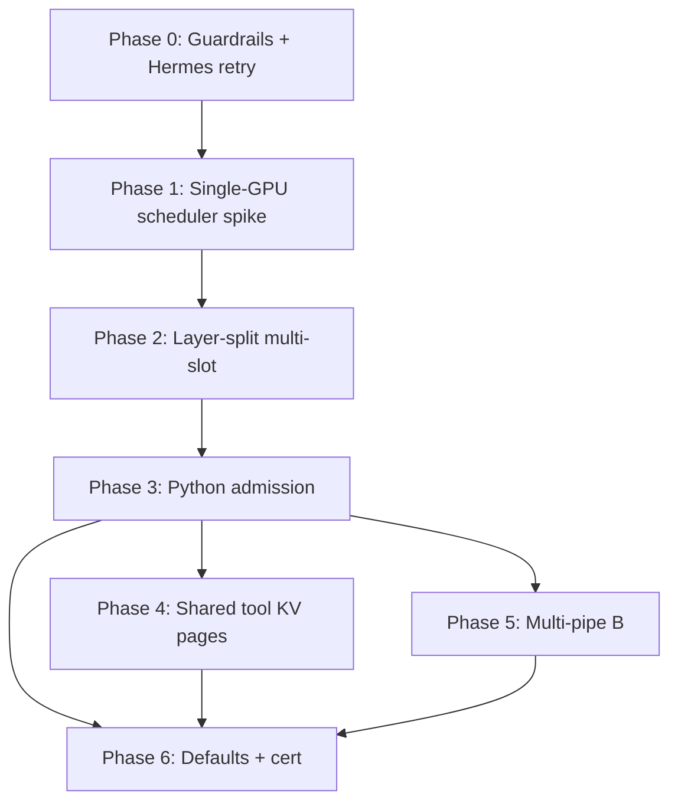

# Next-Gen Plan: Multi-Request Admission + Shared KV Pages

**Status:** Phase 0 done · Phase 1 gate passed (2026-07-13) · Phase 2 next · July 2026  
**Branches:** `feat/native-mmproj-multi-request` (`lucebox-hub`, `model-runner-v4`)  
**Related:** [research-nextgen-archecture.md](./research-nextgen-archecture.md) (GPU1 roles),
[ephemeral-503-flood-fix-plan.md](./ephemeral-503-flood-fix-plan.md) (lock/503 behavior),
[lucebox-sharded-snapshots-spec.md](./lucebox-sharded-snapshots-spec.md) (RESTORE_CHAIN),
[inference-engine-north-star.md](./inference-engine-north-star.md),
[warm-ttft-and-usage-timings.md](./warm-ttft-and-usage-timings.md) (warm deepen + WebUI metrics)

This plan turns the multi-request / shared-KV conversation into **deployable
phases**. It does **not** replace layer-split or tool-split; it sits on top of
the native-mmproj + RESTORE_CHAIN baseline.

---

## 1. Problem

Today the Live path is:

```text
Hermes / cron / WebUI
  → FastAPI (server_tools.py)
  → one daemon stdin/stdout
  → one live KV
  → Python PriorityDaemonLock
```

Consequences:

- Chat holds the lock → cron (and other traffic) waits or gets **HTTP 503**.
- llama.cpp felt better under overlap because `--parallel N` admits multiple
  sequences; dflash rejects/serializes at the **wrapper**, not because the GPU
  cannot ever multiplex.

Ephemeral-yield / Retry-After work ([ephemeral-503-flood-fix-plan.md](./ephemeral-503-flood-fix-plan.md))
improves client behavior. It does **not** give true overlapping generates.

---

## 2. Goals

| Priority | Goal | Non-goal |
|----------|------|----------|
| P0 | Chat + cron can overlap without hard fail | Matching llama.cpp continuous-batch TPS |
| P0 | Keep tool-split, RESTORE_CHAIN, vision, layer-split | Blind merge of upstream PR #135 |
| P1 | HTTP interaction ≈ llama.cpp (admit, queue, stream) | Replacing FastAPI with C++ HTTP in phase 1 |
| P2 | Reduce multi-slot VRAM via shared prefix pages | N full private 131K caches |
| P3 | Transport upgrade: multi-pipe / Unix sockets (B) | Second weight copy / second daemon process |

**Success (product):** Daily AI News Digest (cron) completes while a scoped chat
is generating — wait or time-slice, not a failed run from busy-engine 503.

---

## 3. Vocabulary (do not conflate)

| Term | Where | Purpose |
|------|--------|---------|
| **Snapshot slot** | Mostly CPU RAM (thick/thin/tool pins) | Reuse work **across turns**; cold storage |
| **Target-cache slot** | Live VRAM KV/SSM | Independent **in-flight** conversation state |
| **Page / shared buffer** | GPU pool + page table | Physical sharing of **identical prefix** KV across target-cache slots |

- Multiple chats **can** use one target-cache slot **serially** (restore → generate → swap).
- Multiple chats **cannot** share one live KV **concurrently** without corrupting histories — unless memory is partitioned (separate slots or shared pages + private suffixes).
- H2D restore (~0.5s) is a **once-per-turn** bus cost; after restore, decode reads **local** live KV. That tax beats re-prefilling 15–20k tools.

---

## 4. Target architecture

### 4.1 Transport ladder: C now, clean path to B

| | **C — Single pipe + scheduler (ship first)** | **B — Multi-pipe / sockets (later)** |
|--|-----------------------------------------------|--------------------------------------|
| Process | One daemon, shared weights | Same |
| Client IO | One stdin/stdout; tagged frames `[-2, req_id, tok]` | N Unix sockets / fds; per-conn streams |
| Concurrency core | `SlotPool` + quantum scheduler | **Same** core |
| Python | Demux + slot allocator; drop exclusive lock for multi-slot | Simpler per-request attach |

**Design rule:** Never bake “there is only one pipe” into slot or generate logic.
The pipe is one client of an internal scheduler. B swaps transport only.

**Reject:** Two daemon processes (two weight loads) on 2×3090.

### 4.2 Upstream donor (PR #135) — adapt, do not merge

Lucebox PR [#135](https://github.com/Luce-Org/lucebox/pull/135) (`561b0ac`):

- `--target-cache-slots=N`, `REQ` / `SCHED_STEP` / `SCHED_DRAIN` / `CONTINUE`
- `--stream-tagged`, fair quanta, optional `SCHED_BATCH_*` (`n_seqs`)
- Explicit: `shared weights, serialized protocol` — time-sliced (plus limited fusion), not free continuous batching

Our tree uses `server/src/common/daemon_loop.cpp` + **layer-split**. Paths and
RESTORE_CHAIN ownership differ. Treat #135 as a **design donor**; port into our
extracted daemon.

### 4.3 Shared KV page table (memory optimizer on top of slots)

```text
Physical page pool (FA K/V pages; refcounted)
  P0..Pk : tool/system prefix (shared)
  Pa…    : chat A suffix (private)
  Pb…    : chat B suffix (private)

Slot A page map: [P0..Pk, Pa…]
Slot B page map: [P0..Pk, Pb…]
```

- **Full-attn KV pages** can share when token identity matches.
- **DeltaNet / SSM state** stays per-slot unless proven identical (narrower).
- This is **not** a substitute for slots; slots name “who’s generating,” pages
  decide whether prefix bytes are unique.

Narrow first spike: share **tool-prefix FA pages only**; private suffixes + SSM.

### 4.4 VRAM budget (2×24GB, layer-split, TQ3, max_ctx=131072)

Measured headroom on `ai.local` (idle-ish, one live cache): ~12–14 GB free per GPU.

| Practical N | Guidance |
|-------------|----------|
| **2** | Production default (chat + cron) |
| **3–4** | Stretch with monitoring |
| **6–8** | Theoretical only; ignore fragmentation / peaks |
| **16** | PR hard cap; will not fit at 131K |

Levers: lower concurrent `max_ctx`, page-shared tools, keep cold sessions as CPU snaps.

---

## 5. HTTP / interaction parity with llama.cpp

After Phase 2–3 (engine + Python):

| Client-visible | llama.cpp | Our target |
|----------------|-----------|------------|
| Overlapping POSTs | Yes | Yes |
| Streaming | Yes | Yes (demux tagged or per-pipe) |
| Full slots | Queue / timeout | Queue / priority / bounded wait (prefer wait over instant 503 for cron) |
| Under load TPS | Continuous batch | Quanta (+ optional `n_seqs` later) |

~80% interaction parity; ~40–60% load behavior until batching matures. Interaction
parity is enough to fix the P0 product failure.

---

## 6. Deployable phases

Each phase is **independently shippable** behind a flag. Baseline stays green:
native mmproj + RESTORE_CHAIN + tool warmup on `feat/native-mmproj-multi-request`.

| Phase | Deliverable | Impact | Deploy |
|-------|-------------|--------|--------|
| **0** | Docs / design freeze only (no hermes-agent fork) | Low — clarifies path; **no** cron-503 fix | **Done** — see [phase1-pr135-port-map.md](./phase1-pr135-port-map.md) |
| **1** | Single-GPU scheduler + slots (`N=2` spike) | Medium (dev) — proves C works; **no** prod admission yet | **Gate passed (2026-07-13)** — `scripts/phase1_multi_request_smoke.py` on `ai.local` side binary `test_dflash.phase1`; prod compose still `N=1` |
| **2** | Layer-split multi-slot on real 2×3090 path | High (engine) — required for `ai.local`; still no HTTP fix until 3 | Flag-gated recreate — [phase2-layer-split-multi-slot-spike.md](./phase2-layer-split-multi-slot-spike.md) |
| **3** | Python slot allocator; drop exclusive lock | **Critical (product)** — chat+cron can overlap; kills hard busy-503 | Compose `N=2` |
| **4** | Shared tool-prefix KV pages | Medium (capacity) — lowers VRAM for `N>2` / long tools; not required for P0 | Optional flag |
| **5** | Multi-pipe transport (B) | Low–medium (ops) — simpler clients; same scheduler | Optional |
| **6** | Defaults, overlap cert, SOP | Medium (hardening) — makes 2–3 production-safe | Productize |

Phases 4 and 5 are parallelizable after Phase 3. **Product unblock is Phase 3**; 1–2 are prerequisites on the engine.

### Phase 0 — Guardrails & prod bandage

**Repos:** docs only (do **not** patch hermes-agent — stay in sync with upstream)  
**Deploy:** none required for Hermes core  
**Status:** Rolled back from hermes-agent (2026-07-13). Busy retry/skip belongs upstream
or a local overlay outside this fork; do not land Phase 0 cron policy in hermes-agent.

| Work | Detail |
|------|--------|
| Design freeze | This doc + mapping note: #135 symbols → `daemon_loop` / `LayerSplitBackend` |
| Baseline protect | Do not disable tool-split / restore while porting |
| Busy handling | Prefer engine multi-slot (Phases 1–3). Until then, tolerate cron 503s or handle
  retries in **upstream** Hermes / a non-forked overlay — not in this hermes tree |

**Exit gate:** Plan + mapping frozen; hermes-agent tree clean vs intended upstream baseline.

**How to measure (when busy policy exists somewhere else):**

| Check | Pass criteria |
|-------|----------------|
| Controlled collide | Digest does not hard-fail solely because chat held the GPU |
| Idle cron | Digest with free engine still succeeds first try |

---

### Phase 1 — Engine port spike (single-GPU path, N=2)

**Repos:** `lucebox-hub`  
**Deploy:** opt-in binary flags only; production stays `N=1`

| Work | Detail |
|------|--------|
| Port slots | `--target-cache-slots=N` (default 1), `DaemonSlotState`, shared weights |
| Port protocol | `REQ` / `CONTINUE` / `SCHED_STEP` / `SCHED_DRAIN` / `CANCEL` + epoch |
| Port stream | `--stream-tagged` frames |
| Internal API | `SlotPool` + `Scheduler` interfaces with **no** hard dependency on stdin |
| RESTORE / snap | Document + test: refuse or idle-only while slot has active req (match #135 intent) |

**Exit gate:**

- `N=1`: generate + SNAPSHOT + `RESTORE` on single-GPU side binary — **passed**
  (`scripts/phase1_multi_request_smoke.py`). Vision / `RESTORE_CHAIN` stay
  layer-split (Phase 2); prod still does not pass `--mmproj` on `test_dflash`.
- `N=2` single-GPU: two short concurrent gens; demux tokens; no crash — **passed**
  (`req_ids=[1,2]`; busy `RESTORE_CHAIN` → `err slot_busy`).

**Do not** enable in lucebox compose yet.

**Follow-on (same branch, not Phase 2):** Warm TTFT deepen for large tool dumps +
layer-split `usage.timings` parse for WebUI metrics — see
[warm-ttft-and-usage-timings.md](./warm-ttft-and-usage-timings.md).

---

### Phase 2 — Layer-split multi-slot (required for `ai.local`)

**Repos:** `lucebox-hub` (`LayerSplitBackend`, sharded KV)  
**Deploy:** flag-gated recreate on `ai.local` (staging first)

| Work | Detail |
|------|--------|
| Per-slot KV | Both shards allocate/switch slot-local state |
| RESTORE_CHAIN | Slot-aware; tool thin pins process-global or explicitly shared |
| VRAM | Start `N=2`; fail loudly on OOM at boot |
| Optional | `SCHED_BATCH_*` only after single-seq scheduler is solid |

**Exit gate:**

- Layer-split binary: 2 concurrent tiny chats stream correctly.
- Tool pin + `RESTORE_CHAIN` on slot 0 while slot 1 idle; then inverse.
- Engine certification subset still green with `N=1`.

---

### Phase 3 — Python multi-slot admission

**Repos:** `model-runner-v4` `lucebox-patch/dflash/scripts/`  
**Deploy:** lucebox recreate; `DFLASH_TARGET_CACHE_SLOTS=2` (name TBD)

| Work | Detail |
|------|--------|
| Replace exclusive lock | Slot allocator: conversation → slot; free list; wait queue |
| Protocol driver | Speak scheduler + demux tagged stream → per-HTTP SSE |
| Priority | scoped/chat > cron > ephemeral |
| Tool-split | Shared thin tool pins; per-request thick/conversation on its slot |
| Busy policy | Prefer queue/wait for cron; 503 only when queue + wall budget exhausted |

**Exit gate:**

- Manual: chat stream + cron completion overlapping; cron succeeds or waits.
- Cert: warm tool path, vision smoke, no exclusive-lock 503 under controlled overlap.
- Metrics: log `slot_id`, `queue_wait_ms`, `quantum` stats.

---

### Phase 4 — Shared tool-prefix KV pages (narrow)

**Repos:** `lucebox-hub` primarily; Python restore orchestration  
**Deploy:** flag `DFLASH_SHARED_TOOL_KV_PAGES=1` (name TBD)

| Work | Detail |
|------|--------|
| Page pool | Fixed-size FA pages for tool prefix; refcount |
| Slot maps | After tool restore, slots reference shared pages; do not duplicate H2D into each live buffer |
| COW | First diverge (conversation tokens) allocates private pages |
| Non-goals this phase | Full radix tree; SSM sharing; arbitrary fork sharing |

**Exit gate:**

- Two concurrent agent-shaped requests with **identical** tool prefix: GPU memory for tools ≈ 1× (probe via `nvidia-smi` / internal counters).
- Decode correctness vs private-KV baseline (logit or golden token checks on short gens).
- Cancel / slot reuse does not use-after-free pages (refcounts).

---

### Phase 5 — Transport B (multi-pipe)

**Repos:** hub accept loop + mrv4 attach  
**Deploy:** optional; only after Phase 3 stable

| Work | Detail |
|------|--------|
| Listen | Unix socket (or inherited fd pool) |
| Map | conn → slot lease |
| Stream | Per-conn tokens; retire tagged demux for new path |
| Compat | Keep C pipe for tests / fallback |

**Exit gate:** Two HTTP handlers each with own pipe; same SlotPool; C path still works.

---

### Phase 6 — Hardening & product defaults

| Work | Detail |
|------|--------|
| Defaults | `N=2` on ai.local when certified; queue budgets documented |
| Cert | Extend `run-engine-certification.sh` with overlap scenario |
| SOP | Update [deployment-sop.md](./deployment-sop.md) / compose env |
| Stretch | `N=3–4` only with lower ctx or Phase 4 pages proven |
| Docs | Feed measured numbers back into [research-nextgen-archecture.md](./research-nextgen-archecture.md) § multi-request |

---

## 7. Phase dependency graph



Phases 4 and 5 are **parallelizable** after Phase 3. Phase 4 is preferred if VRAM
pressure blocks useful `N>2`; Phase 5 is preferred if Python demux complexity
dominates.

---

## 8. Explicit non-goals / anti-patterns

| Anti-pattern | Why |
|--------------|-----|
| `git merge` PR #135 onto tip | Path skew; RESTORE conflicts; layer-split missing |
| Two `Popen` daemons | Second weight copy; OOM |
| Shared live KV without page maps | Corrupts concurrent chats |
| Remote live KV on GPU1 for all layers | Already ruled out in next-gen research (~17× slower than local) |
| Blocking on full continuous batching | Nice later; not required for P0 admission |
| Disabling tool-split to “make multi-request easier” | Violates north star |

---

## 9. Suggested ownership & order of attack

| Next concrete action | Owner surface |
|----------------------|---------------|
| Phase 0 Hermes busy policy | Hermes / gateway cron delivery |
| Phase 1 hunk→file mapping from `refs/tmp/pr135` | `lucebox-hub` |
| Spike `SlotPool` in `daemon_loop` with `N=2` smoke | `lucebox-hub` |
| Defer Python until Phase 2 exit gate | `model-runner-v4` |

---

## 10. Open questions (resolve during Phase 1–2)

1. Tool thin pins: one global pin shared by all slots, or per-slot pin ids?
2. Mid-generate `RESTORE_CHAIN` on another slot: allow only if target slot idle?
3. Cron priority: fair quanta vs chat-preempts-cron?
4. Boot-time alloc of full `max_ctx` per slot vs lazy grow (affects Phase 4 urgency)?
5. Does layer-split draft/verify need per-slot draft state or only target KV?

---

## 11. Changelog

| Date | Note |
|------|------|
| 2026-07-13 | Initial plan from multi-request / shared-KV design conversation |
| 2026-07-13 | Phase 0 hermes-agent cron busy policy rolled back (stay upstream-sync) |
