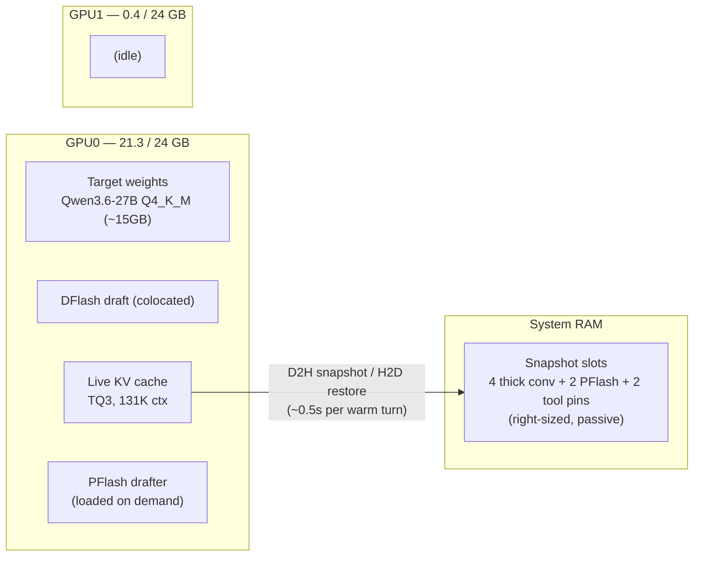
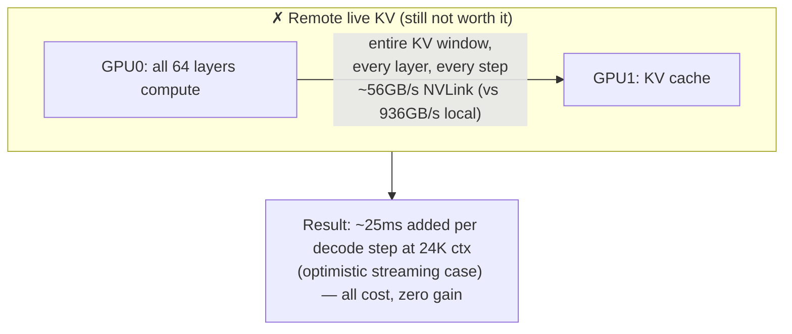
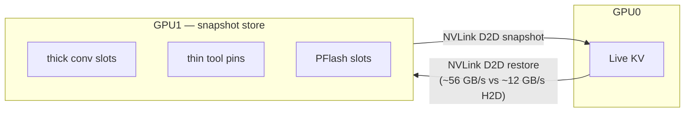
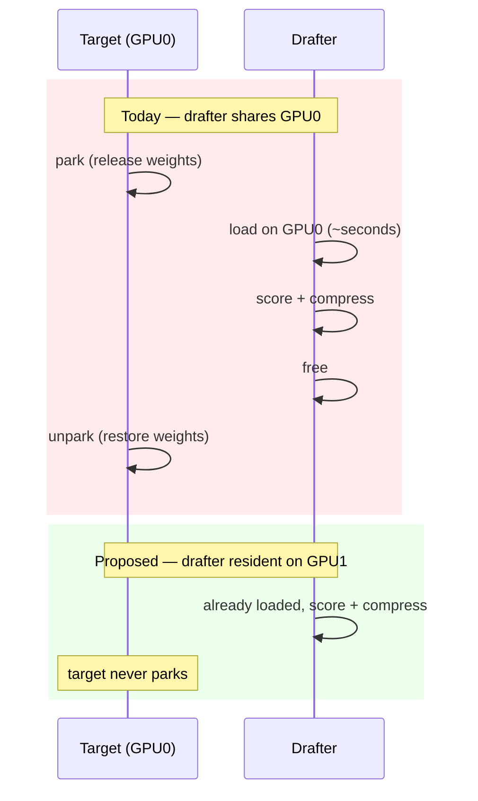
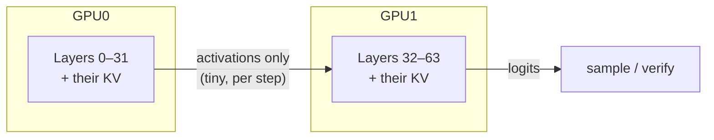
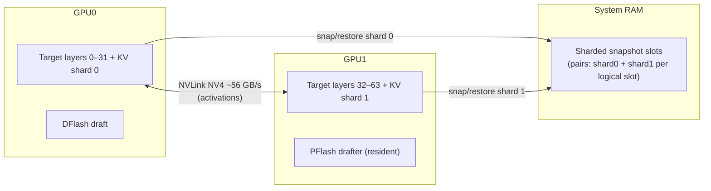

# Research: Next-Gen Architecture — Putting the Second GPU to Work

*Working notes toward a white paper. July 2026.*

Status quo after the spec-decode tuning pass: the runner delivers 51–94
tok/s and 20× warm-turn prefill on **one** of the two RTX 3090s, and the
second GPU sits idle. This document analyzes how (and whether) GPU1 can be
recruited — what is physically possible, what is not, and what each viable
option buys.

## 1. Current State



GPU1 went idle deliberately: colocating the DFlash draft onto GPU0
eliminated a 700ms/step cross-GPU feature copy and a ~13ms/step logits
bridge. Decode got 2–9× faster — but the trade left 24GB of VRAM and a full
GA102 die doing nothing.

### Interconnect: NVLink NV4 (measured)

The two 3090s are bridged with NVLink, confirmed on the host:

```
$ nvidia-smi topo -m        →  GPU0 ↔ GPU1: NV4
$ nvidia-smi nvlink -s      →  4 links × 14.062 GB/s per GPU
```

That is **~56 GB/s per direction (~112 GB/s bidirectional)** between the
GPUs — roughly 2× the effective PCIe 4.0 x16 path. `DFLASH_PEER_ACCESS=1`
is already set, so P2P copies route over the bridge. Every cross-GPU
number in this document uses the measured NVLink figure, not PCIe.

## 2. The Naive Idea, and Why It Fails (Even With NVLink)

**"Use GPU1 exclusively for the KV cache."**

The KV cache is not a passive buffer. Every attention layer reads the
*entire attended KV window* on every forward pass. Compute must be where
the data is — and the comparison that matters is not NVLink vs PCIe, it is
NVLink vs **local VRAM**:

| Path | Bandwidth | Relative |
|---|---|---|
| GPU0 VRAM ↔ GPU0 SMs (local) | **~936 GB/s** | 1× |
| GPU0 ↔ GPU1 over NVLink NV4 (measured) | ~56 GB/s | **~17× slower** |
| GPU0 ↔ GPU1 over PCIe 4.0 x16 (P2P) | ~25–30 GB/s | ~35× slower |



Quantified at 24K context: one decode step reads on the order of 1–1.5 GB
of TQ3 KV across all layers. Locally that is ~1.5ms of memory traffic
folded into the ~110ms step. Pulled over NVLink it is **~25ms added per
step** — and that is the optimistic streaming number. Attention's access
pattern is latency-sensitive and scattered, so real-world remote-memory
attention degrades worse than raw bandwidth suggests. 51 TPS at 24K would
drop to roughly 35–40, in exchange for nothing: GPU0 still performs all
the compute, so no resource is actually freed.

NVLink therefore moves the verdict from *catastrophic* (PCIe) to *strictly
worse than local* — mitigated, but never beneficial. This is why no
mainstream engine (vLLM, TensorRT-LLM, llama.cpp) offers "KV on a
different GPU than its layers": KV placement always follows layer
placement. Where NVLink genuinely pays off is Options A and C below, which
it makes cheaper and firmer respectively.

**Verdict: not useful** in any form. The live KV must stay adjacent to the
layers that consume it.

## 3. What GPU1 *Can* Do

Three viable roles, in increasing order of engineering effort and payoff.

### Option A — GPU1 as a snapshot store (the nearest viable cousin)

The *parked* KV copies — prefix snapshots, tool pins, PFlash slots — are
passive data. Nothing computes against them until they're restored. They
currently live in system RAM; GPU1 is a legitimate alternative home, and
`create_snapshot_backend()` already abstracts the storage backend, so this
is a small, contained change.



| | CPU-RAM snapshots (today) | GPU1 snapshots over NVLink |
|---|---|---|
| Restore path | host → device (~12 GB/s effective) | device → device NVLink (~56 GB/s) |
| Warm-turn restore | ~0.5 s | **~0.1 s** |
| Capacity ceiling | system RAM (effectively unlimited slots) | 24 GB — reintroduces a slot budget |
| Failure mode | none new | OOM pressure returns at deep contexts |

**Benefit: upgraded from marginal to worthwhile by NVLink.** With PCIe-only
P2P this option shaved ~250ms per warm turn; the measured NV4 bridge makes
restores ~4–5× faster than host-to-device, cutting the ~0.5s restore to
~0.1s. The capacity trade remains — CPU RAM has no slot ceiling, GPU1 does
— so the strongest shape is a **hybrid**: hot slots resident on GPU1,
overflow (and everything during memory pressure) in CPU RAM. Snapshots are
passive, so unlike §2 this use of remote VRAM has no per-step cost.

### Option B — Pin the PFlash drafter to GPU1

Cold prompts above 16,384 tokens trigger PFlash compression: today the
target model is parked (weights released), the 0.6B drafter loads **on
GPU0**, scores and compresses the prompt, frees, and the target unparks.
With 24GB free on GPU1 the drafter could stay permanently resident there.



**Benefit: eliminates the park/unpark cycle** (several seconds of weight
churn) on every PFlash activation, and removes the transient VRAM spike on
GPU0. The catch: after raising `DFLASH_PREFILL_THRESHOLD` to 16,384, PFlash
fires rarely — only on genuinely huge cold prompts. Low effort, low
frequency, clean win when it does fire.

### Option C — Layer-split the target 32/32 (where the headroom lives)

The dominant cost of every decode step is `verify_compute` — the batched
target forward over the DDTree (60–85ms/step depending on context). Placing
layers 0–31 on GPU0 and 32–63 on GPU1 puts both dies to work; KV for each
half lives beside its layers, so the bandwidth argument from §2 doesn't
apply. Only the small inter-layer activation crosses the interconnect
(~KB per step, not GB) — and on this host that hop rides the measured
NVLink NV4 bridge at ~56 GB/s with lower latency than PCIe, shrinking the
split's overhead term and making the projections below firmer. NVLink is
the standard fabric for exactly this pattern.



Projected effect: `verify_compute` roughly halves. Applying that to the
measured step budgets:

| Context | Step today | Step w/ split (est.) | TPS today | TPS est. |
|---|---|---|---|---|
| 2K | ~79 ms | ~52 ms | 94 | **~140** |
| 8K | ~91 ms | ~60 ms | 70 | **~107** |
| 24K | ~110 ms | ~69 ms | 51 | **~81** |

**This is the option that clears 80 TPS at every context length, including
the hard 24K case.**

**What blocks it:** the layer-split daemon mode does not implement the
snapshot protocol. `server_tools.py` currently zeroes
`prefix_cache_slots` and `prefill_cache_slots` when `--target-gpus` is set
— enabling the split today would forfeit the 20× warm-turn caching that
fixed chat latency in the first place. Each snapshot/restore would need to
address *sharded* KV: per-shard slot ranges, a `RESTORE_CHAIN` that fans
out to both shards atomically, and depth bookkeeping per shard.

## 4. Decision Matrix

All rows assume the measured NVLink NV4 interconnect (~56 GB/s):

| Option | Possible? | Effort | Decode TPS | Warm-turn latency | Risk |
|---|---|---|---|---|---|
| Live KV exclusively on GPU1 | **No** — ~17× slower than local VRAM even over NVLink | — | −20–30% (all cost, no gain) | — | — |
| A: Snapshot store on GPU1 (hybrid w/ CPU RAM) | Yes | Small | none | −~0.4s (0.5s → 0.1s restore) | VRAM slot ceiling returns (mitigated by hybrid) |
| B: PFlash drafter on GPU1 | Yes | Small | none | −seconds, rare cases | negligible |
| C: Layer-split + sharded snapshots | Yes | **Large** | **+50–60%** | unchanged | protocol work in C++ daemon |

## 5. Proposed Next-Gen Architecture

The end state combines C with B over the NVLink fabric, keeping snapshots
in CPU RAM (unbounded slots) with optional hot-slot residency in leftover
GPU VRAM (Option A hybrid) if post-split profiling shows restore time
matters:



Expected combined profile on the same 2×3090 hardware, same 27B model,
same 131,072-token window:

- **80–140 TPS decode** across all context lengths (vs 51–94 today)
- **Warm-turn prefill unchanged** (~0.5s at 8.5K) — caching preserved
- **No PFlash park/unpark stalls** on huge cold prompts
- Draft acceptance remains the content-dependent ceiling; a higher-precision
  draft GGUF (Q8/BF16) is the orthogonal lever

The critical-path research item is the **sharded snapshot protocol**:
extending `SNAPSHOT` / `SNAPSHOT_THIN` / `RESTORE_CHAIN` to operate on
per-shard KV ranges with atomic cross-shard commit semantics. Everything
else in this document is configuration.
