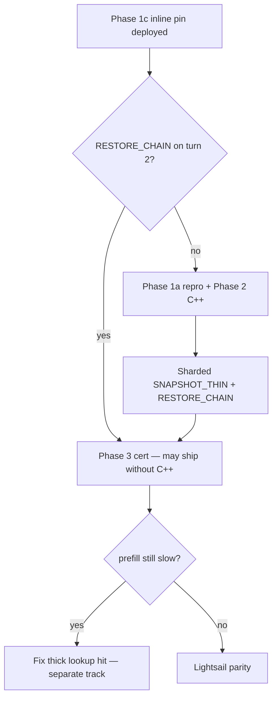

# RESTORE_CHAIN recovery — Phases 1–3 implementation plan

**Status:** Phase 1c + Phase 3 (patch) implemented in `model-runner-v4`; Phase 2 (C++ spec) documented for `lucebox-hub`.  
**Goal:** Warm Hermes agent turns via `RESTORE_CHAIN` on layer-split 2×3090 with ~20K-token tool schemas.  
**Repos:** `model-runner-v4` (Python patch + cert), `lucebox-hub` (C++ daemon, Phase 2)

---

## Problem summary

| Symptom | Cause |
|---------|--------|
| No `RESTORE_CHAIN` in logs | `tool_slot_hit` is always `None` |
| No `tool KV pinned` | `SNAPSHOT_THIN` skipped or crashes at `kv_end ≈ 20590` |
| 90–114s prefill every turn | Cold full prefill; thick `lookup hit` also missing |
| Guard `DFLASH_TOOL_SNAPSHOT_MAX_KV=16384` | Workaround for daemon crash on large thin snaps |

`RESTORE_CHAIN` is only emitted when `tool_ctx.tool_slot_hit is not None` (`server_tools.py` `_compose_daemon_cmd`).

---

## Phase 0 — Baseline (ops)

Archive a red scorecard before/after:

```bash
cd /media/data/projects/model-runner-v4
PROXY_URL=http://ai-platform-proxy:8000 \
  bash scripts/run-engine-certification.sh
```

Save artifacts under `bench-results/`. Expect: `RESTORE_CHAIN=0`, `agent_after_tool_prefill_ms >> 500`.

---

## Phase 1 — Characterize + fast-path pin (model-runner-v4)

### 1a. Force `SNAPSHOT_THIN` repro (ai.local staging)

Script: `scripts/repro-snapshot-thin.sh`

1. Set `DFLASH_TOOL_SNAPSHOT_MAX_KV=0` and `DFLASH_TOOL_INLINE_SNAP_PIN=0` in `.env`
2. Recreate `model-runner-v4-lucebox`
3. Run one tool-split bench turn
4. Capture `docker logs`, `dmesg`, daemon exit code

**Deliverable:** Crash signature for `lucebox-hub` Phase 2 (segfault line, OOM, or bad reply).

### 1b. Code-path comparison (lucebox-hub)

In `test_dflash` legacy inline loop, compare:

| Path | Command | Layer-split @ 20K |
|------|---------|-------------------|
| Inline thick | `snap=<cut>:<slot>` during prefill | Works (logs show `inline-snap committed`) |
| Post-hoc thin | `SNAPSHOT_THIN <slot> 0 <kv_end>` | Crashes or unsafe |

Spec: `docs/lucebox-sharded-snapshots-spec.md`

### 1c. Inline-snap tool pin (implemented in patch)

**Hypothesis:** If inline `snap=` at `tool_prefix_len` into the **tool pin slot** (4/5) produces the same KV blob as `SNAPSHOT_THIN`, `RESTORE_CHAIN thin=<slot>` works without post-hoc thin snap.

**Behavior:**

1. Turn 1 cold (`pending_tool_snap`): append `snap=<tool_prefix_len>:<pin_slot>` to the prefill command; **defer** thick conv `snap=` on the same request (daemon supports one `snap=` per line).
2. After decode: if daemon ack `[snap] inline slot=<pin_slot>`, call `ToolSlotCache.confirm()` — log `tool KV pinned (inline)`.
3. Turn 2+: `tool_slot_hit` set → `RESTORE_CHAIN` path.
4. If inline pin fails, fall back to `SNAPSHOT_THIN` (still subject to `DFLASH_TOOL_SNAPSHOT_MAX_KV` until Phase 2).

**Env:**

| Variable | Default | Purpose |
|----------|---------|---------|
| `DFLASH_TOOL_INLINE_SNAP_PIN` | `1` | Enable Phase 1c fast path |
| `DFLASH_TOOL_SNAPSHOT_MAX_KV` | `16384` | Cap legacy `SNAPSHOT_THIN` fallback only |

**Code:** `tool_split/daemon_bridge.py`, `server_tools.py` `_compose_daemon_cmd`, `_finish_tool_inline_snap`, `_commit_tool_snap_if_needed`.

---

## Phase 2 — Sharded snapshots (lucebox-hub C++)

Full spec: `docs/lucebox-sharded-snapshots-spec.md`

Minimum daemon changes:

1. `SNAPSHOT_THIN` — per-GPU D2H for `[kv_start, kv_end)` on layer-split KV shards
2. `RESTORE_CHAIN` — atomic multi-shard restore; consistent `cur_pos` ack
3. Right-sized CPU alloc per shard (not `max_ctx`)
4. Soft errors instead of process death
5. Reuse inline-snap copy path for thin range capture where possible

**Branch:** `feat/sharded-snapshots` (from `feat/tool-split-agent-cache` / `feat/native-mmproj`)

**Build on ai.local:** `scripts/build-native-mmproj-ai.local.sh` or deployment SOP § C++ rebuild

---

## Phase 3 — Cert + guard tuning (model-runner-v4)

1. **Benchmark:** `benchmark-tool-split-thorough.py` — `LARGE_TOOLS` fixture (~synthetic large schema), assert inline pin / `RESTORE_CHAIN` markers
2. **Unit tests:** `test_tool_inline_snap_pin.py`, `handler_reliability` env for `DFLASH_TOOL_INLINE_SNAP_PIN`
3. **Cert:** `run-engine-certification.sh` — grep for `tool KV pinned (inline)` and `lookup hit`
4. **After Phase 2 proven:** raise or remove `DFLASH_TOOL_SNAPSHOT_MAX_KV` default

### Sign-off gates

| Check | Pass |
|-------|------|
| Turn 1 | `tool KV pinned` or `tool KV pinned (inline)` |
| Turn 2+ | `RESTORE_CHAIN thick=… thin=…` |
| Speed | `agent_after_tool_prefill_ms < 500` |
| Stability | No daemon death in 30m logs |
| Pollution | `test_cache_pollution.py` green |

---

## Deployment (git only)

```bash
# Dev
git push origin feat/vision   # model-runner-v4 patch

# ai.local
cd /media/data/projects/model-runner-v4 && git pull && docker compose up -d --force-recreate model-runner-v4-lucebox
PROXY_URL=http://ai-platform-proxy:8000 bash scripts/run-engine-certification.sh
```

Phase 2 additionally: pull `lucebox-hub-src`, rebuild `test_dflash`, recreate container.

---

## Decision tree



---

## Related docs

- [whitepaper-agent-inference-cache.md](./whitepaper-agent-inference-cache.md)
- [engine-certification-plan.md](./engine-certification-plan.md)
- [lucebox-sharded-snapshots-spec.md](./lucebox-sharded-snapshots-spec.md)
- [deployment-sop.md](./deployment-sop.md)
