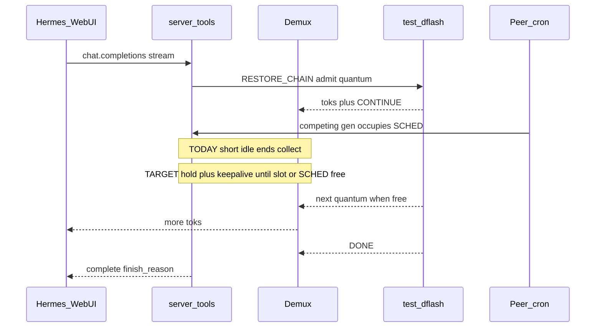

# Stream finish reliability plan

**Status:** Phase A+B implemented (visible truncation + admit-hold between quanta)  
**Home:** Engine (`model-runner-v4` / lucebox)  
**Trigger chats:** `1492af52-…`, `77441680-…`  
**Related:** sticky thick pins (shipped), multi-request quantum admit, `tagged_stream_demux`, SSE keepalives (`DFLASH_SSE_KEEPALIVE_SEC`)

---

## 0. Design principle (product)

**Slowness is OK. Silent truncation is not.**

Regardless of how slow the model or how busy the GPUs are:

1. **Hold** until a decode/admit slot (and SCHED quantum) is available — queue, don’t guillotine.
2. **Keep the client alive** with SSE comments / heartbeats while waiting or between quanta.
3. Only end a stream on: natural stop/DONE, **client** disconnect/cancel, or an explicit, visible error after a true hard ceiling (not a short inter-quantum idle).

```text
BAD:  wait 60s for next quantum → pretend stream finished → CANCEL → orphans
GOOD: wait (minutes if needed) → keepalive → next quantum → … → DONE
```

---

## 1. Problem

Sticky thick pins fixed mid-loop re-prefill. Unfinished chats are a **different** bug:

```text
RESTORE_CHAIN admit → emit 128, remaining ≫ 0
  → ~N quanta (observed: 128 / 256 / 384)
  → HTTP collect stops (short continue_idle / post_token_idle)
  → CANCEL after_collect
  → demux_orphan … dropped=…  (tokens still arriving)
  → client sees truncated / “never finished”
```

Concurrent cron mid-generation delays `SCHED_*`. Peer admits and slot thrash make waits longer; today’s demux treats that delay as “end of stream.” Later resume: `lookup miss reason=evicted` + cold recovery.

Also seen on `77441680`: empty/broken tool calls (`<function=terminal></function>`), admit ack **req-id mix-ups**, final answer cut at exactly one quantum (“Here's my full analysis…”).



---

## 2. Success criteria

- Under concurrent chat + cron (N≥2), an **admitted** interactive stream runs until **stop / DONE / client disconnect** — not short inter-quantum idle while `remaining > 0`.
- While waiting for the next quantum or for a free slot: **SSE keepalives** continue (existing `sse_keepalive_seconds()` path, ensure it covers admit-wait and between-CONTINUE gaps).
- **Queue for slots** when capacity is full: interactive requests wait (bounded by a large wall / client cancel), rather than stealing an in-flight peer or returning a fake complete.
- Unavoidable hard failure is **visible** (`finish_reason=error` / SSE error) — never silent complete.
- No `demux_orphan` drops after HTTP collect unless the **client** cancelled.
- In-flight interactive decode slot + thick pin not stolen until stream completes.
- Cert: chat + cron concurrency that used to truncate stays green; intentional multi-minute SCHED delay still delivers full reply.

---

## 3. Root causes

| # | Cause | Where |
|---|--------|--------|
| 1 | Demux ends after CONTINUE if next burst exceeds `continue_idle` (60s) / `post_token_idle` (30s) while admit `remaining > 0` | `tagged_stream_demux.py` `iter_tokens` |
| 2 | Handler `CANCEL`s after collect → orphans | `server_tools.py` |
| 3 | Cron / peer load delays interactive `SCHED_*`; we treat delay as EOS | scheduler + demux idle |
| 4 | Busy/full slots → thrash or early fail instead of **hold + keepalive** | admission / daemon lock |
| 5 | Other interactive scopes evict a resumed chat’s thick pin | `prefix_cache.py` |
| 6 | Admit ack / demux **req-id mix-ups** under concurrency | multi-request path |

---

## 4. Target behavior

### Hold until free

- **In-flight admitted request:** never release/cancel because a peer is slow; wait for next quantum with progress-aware wall (reset on real tokens and on CONTINUE heartbeats from daemon if present).
- **New request, no free slot:** enqueue behind in-flight work (interactive ahead of cron). Stream opens immediately; emit SSE keepalives until admit/start succeeds or client cancels.
- **Do not** “succeed” an incomplete generation to free a slot for someone else.

### Keep alive

- Reuse / extend `DFLASH_SSE_KEEPALIVE_SEC` (default 15s) for:
  - queue wait before first token
  - gaps between quanta while `remaining > 0`
  - long prefill
- Proxy must forward SSE comments; Hermes/WebUI must not treat keepalive as hang (verify).

### Visible failure only as last resort

- Hard ceiling (e.g. absolute request wall after no progress) → explicit error + `finish_reason=error`, log `stream_truncation`.
- Never `finish_reason=stop` with `remaining > 0`.

---

## 5. Phased delivery

### Phase A — Make truncation visible (fast) ✅

- Log `stream_truncation req=… generated=… remaining=… reason=…`.
- Non-success finish on truncated collects (`finish_reason=error` + SSE/JSON `code=stream_truncation`).
- Counter/event: `demux_orphan_after_collect` (armed on CANCEL after truncation).

### Phase B — Hold between quanta (correctness; core of “don’t fail because slow”) ✅

In `TaggedStreamDemux.iter_tokens` + `server_tools`:

- While **admitted** (`admit_hold=True`): **no short `continue_idle` / `post_token_idle` exit**. Wait using progress-aware wall until DONE / stop / n_gen / wall.
- Admit path passes `admit_hold=use_admit` and `StreamCollectOutcome`.
- Unit tests: CONTINUE + delay ≫ continue_idle but &lt; wall → full sequence; admit-hold stall → `end_reason=wall` + `is_truncated`.
- SSE keepalive already covers quantum gaps on the live-emit path (`DFLASH_SSE_KEEPALIVE_SEC`).

### Phase C — CANCEL only when safe

- Prefer drain to DONE before CANCEL when `remaining > 0` and client still connected.
- Cancel reasons: `client|done|hard_wall|error` (not only `after_collect`).

### Phase D — Queue for slots + interactive priority

- When slots/locks busy: **wait** (scoped interactive max_wait already exists — raise/align so chat holds instead of 503/truncate).
- Pause or defer **new cron admits** while an interactive request is admitted and has `remaining > 0`.
- Keepalive during queue wait.

### Phase E — In-flight pin / slot stickiness

- Mark scope `in_flight` for generate duration; LRU / target-cache must not steal mid-stream.
- After true idle (not in_flight), eviction under capacity remains OK.

### Phase F — Admit/demux req correlation

- Fix wrong `admit_ok` peer req-id mix-ups seen on `77441680` (`gen_start req=N` vs `RESTORE_CHAIN_ADMIT req=N-1`).
- Tests for N=2 concurrent admits.

### Phase G — Certify

- Load test: long interactive gen + concurrent cron + artificial SCHED delay; assert full DONE, keepalives observed, zero orphans.
- Triage by conversation id.
- Soak on ai.local with Hermes webchat + cron.

**Order:** A → **B** (hold) → C → **D** (queue + keepalive) → E → F → G.

---

## 6. Out of scope

- Making the model faster / shrinking context.
- Hermes tool-loop quality (except consuming visible truncation errors).
- Full heterogeneous part-hash (separate plan).

---

## 7. Key files

- `lucebox-patch/dflash/scripts/tagged_stream_demux.py`
- `lucebox-patch/dflash/scripts/server_tools.py`
- `lucebox-patch/dflash/scripts/handler_reliability.py` (SSE keepalive, lock waits)
- `lucebox-patch/dflash/scripts/test_tagged_demux_idle_between_quanta.py`
- `lucebox-patch/dflash/scripts/prefix_cache.py` (Phase E)
- Proxy/WebUI: forward keepalives; show incomplete `finish_reason` (thin)
