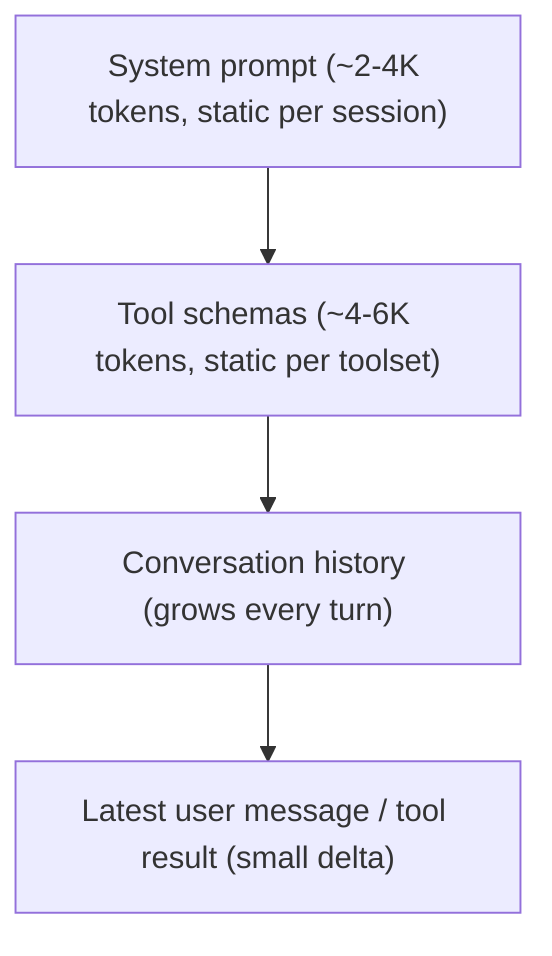
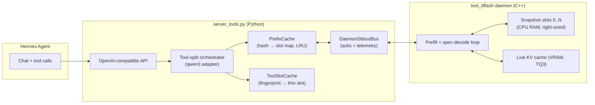
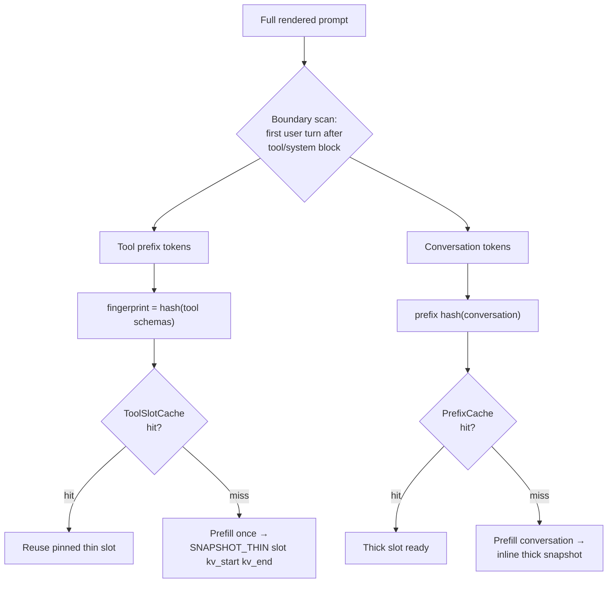
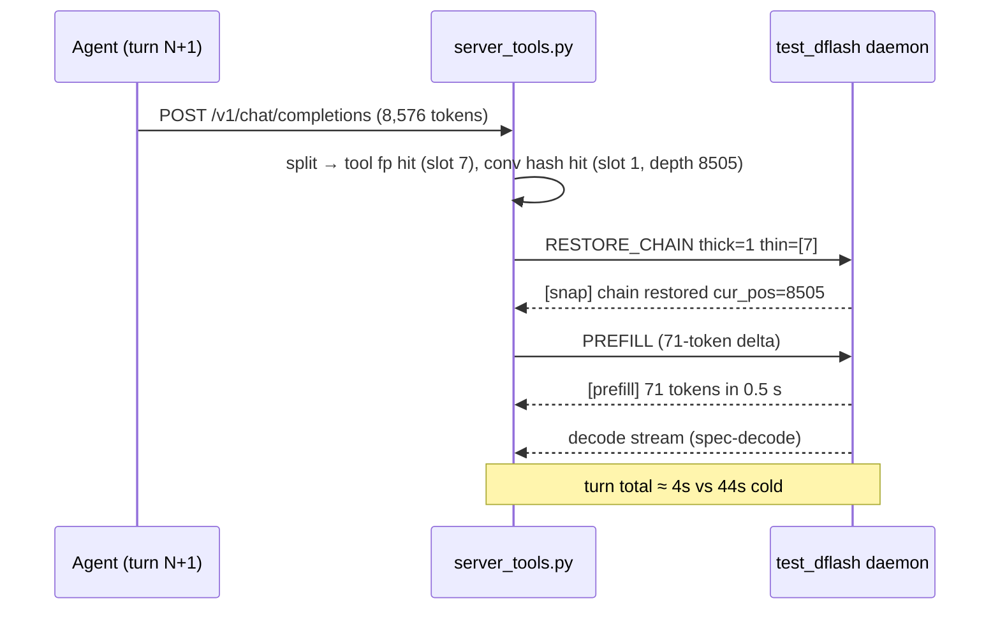
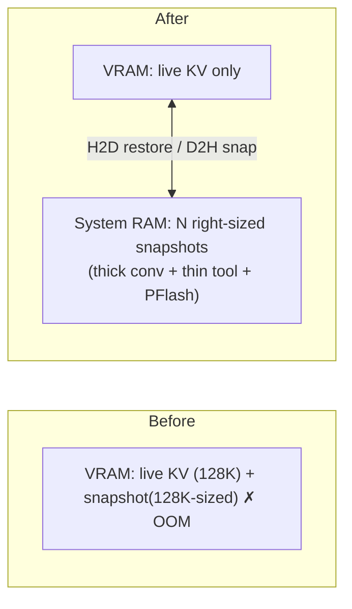
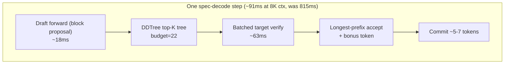

# Fast Multi-Turn Agent Inference on Consumer GPUs

**Tool-Split KV Caching, Chained Snapshot Restore, and Tuned Block-Diffusion
Speculative Decoding for 128K-Context Agents on 2×RTX 3090**

*July 2026 — davidmroth/lucebox-hub, `feat/tool-split-agent-cache`*

---

## Abstract

Agentic LLM workloads (Hermes-style tool-calling assistants) have a prompt
structure that defeats conventional inference servers: every turn re-sends a
large, mostly-static prefix (system prompt + tool schemas) followed by a
growing conversation, and the model is invoked several times per user message
(main turn, tool-result turns, and auxiliary calls such as title generation
and memory curation). On a 27B-parameter model served from two 24GB consumer
GPUs, a naive server spends 30–45 seconds per turn re-prefilling context it
has already seen, then decodes at under 8 tokens/second.

This work combines four techniques to make the same hardware serve the same
model at interactive speeds while keeping the full 131,072-token context
window: (1) **tool-split KV caching**, which separates the tool-schema KV
from conversation KV and pins it in dedicated snapshot slots keyed by a
schema fingerprint; (2) **chained snapshot restore** (`RESTORE_CHAIN`),
which rebuilds a request's KV state from a thick conversation snapshot plus
thin tool snapshots in one daemon command; (3) **right-sized CPU-RAM
snapshots**, which remove the VRAM ceiling that previously forced a choice
between context length and cache capacity; and (4) **profiled speculative
decoding**, where per-step telemetry exposed a 700ms/step cross-GPU transfer
that, once eliminated, raised decode throughput 2–9×.

Measured end-to-end on Hermes agent traffic: warm-turn prefill drops from
~11s to ~0.5s at 8.5K tokens (**20× speedup**), and decode rises from
7–8 tok/s to 51–94 tok/s depending on context length.

---

## 1. Problem: The Agent Prompt Anti-Pattern

A single Hermes user message produces a fan-out of model calls, each with a
prompt shaped like this:



Three properties make this pathological for a stock llama.cpp-style server:

1. **The static prefix dominates.** 70–90% of the prompt is identical to the
   previous request, but the server re-prefills all of it. At 128K context on
   an RTX 3090 that is tens of seconds per turn.
2. **Multiple prompt families interleave.** The main agent loop, tool-result
   continuations, and auxiliary calls (titles, memory) have *different*
   prefixes. A single-slot cache thrashes: each family evicts the other every
   turn.
3. **Tool schemas are shared across sessions, conversations are not.** A
   monolithic prefix cache treats "same tools, different conversation" as a
   total miss, even though half the prompt is byte-identical.

## 2. Architecture Overview

The system is a Python FastAPI front-end (`server_tools.py`) driving a C++
daemon (`test_dflash`) over stdin/stdout. The daemon owns the model, the KV
cache, and a set of numbered **snapshot slots**; the Python side owns
tokenization, prompt splitting, cache-key management, and the OpenAI-
compatible API surface.



## 3. Innovation 1: Tool-Split KV Caching

The Qwen3 chat template renders tool schemas inside the first system block.
The **tool-split adapter** renders the full prompt, finds the token boundary
where the tool/system prefix ends and the first user turn begins, and slices
the prompt into two segments:

- **Tool prefix** — hashed into a *fingerprint* (schema names, descriptions,
  parameters). Its KV is captured as a **thin snapshot** into a *pinned slot*
  that survives conversation-cache eviction.
- **Conversation** — hashed per prefix-depth into the ordinary **thick**
  prefix-cache slots.



The payoff: two sessions that share a toolset but not a conversation now
share the expensive half of their prefix. Tool KV for a Hermes toolset
(~4–6K tokens) is prefilled **once per server lifetime**, not once per
session per turn.

Slot IDs are budgeted so pinned tool slots live *above* the conversation
slots and are never evicted by them:

```
slots [0 .. prefix_slots)                    → thick conversation LRU
slots [prefix_slots .. +prefill_slots)       → full-prompt PFlash cache
slots [.. +pinned_tool_slots)                → pinned thin tool KV
```

## 4. Innovation 2: Chained Restore (`RESTORE_CHAIN`)

A warm request needs *both* segments back in the live KV cache. Instead of
two round-trips (and two opportunities for partial state), the Python side
issues a single command:

```
RESTORE_CHAIN thick=<slot> thin=<slot,...>
```

The daemon rebuilds KV as `[thick conversation | thin tool ranges]`, sets
`cur_pos`, and acks with the restored depth. The server then prefills only
the delta — typically the latest tool result plus a few framing tokens.



**Correctness under slot reuse.** An LRU cache that reuses slots can serve a
*stale* mapping: hash H says "slot 1 at depth 20,438" but slot 1 was since
refreshed with a shallower snapshot. Both the Python `PrefixCache` and the
C++ side now track the **committed depth per slot** and reject lookups whose
recorded cut does not match, evicting stale keys on slot refresh. This
closed a bug where a small request restoring a slot populated by a large
prior session produced corrupted state (HTTP 503).

## 5. Innovation 3: Right-Sized CPU-RAM Snapshots at 128K Context

The original snapshot implementation allocated every snapshot at
`[head_dim × max_ctx × n_head_kv]` **in VRAM**. At 131,072-token context
that is gigabytes per slot — the daemon OOM'd on the first snapshot, so
caching silently never armed, which is why "it works at 32K but not 128K."

Two changes removed the ceiling:

1. **Right-sizing:** snapshots allocate `[head_dim × snap_pos × n_head_kv]`
   — the actual committed depth, not the theoretical maximum.
2. **CPU backend:** `create_snapshot_backend()` routes snapshot storage to
   system RAM on discrete GPUs. Restore is a host-to-device copy that is
   trivially cheap next to the prefill it replaces.



Consequence: the VRAM-motivated clamp of `prefix_cache_slots → 1` was
removed. Four conversation slots, two PFlash slots, and two pinned tool
slots now coexist at full 131,072-token context on 24GB cards — enough for
the 2+ prompt families a Hermes turn interleaves, so families no longer
thrash each other.

## 6. Innovation 4: Telemetry-Driven Speculative-Decode Tuning

The target model decodes with **DFlash** block-diffusion speculative
decoding: a small draft proposes a block of tokens, a **DDTree**
tree-structured verify (budget 22) checks them in one batched target
forward, and the longest accepted prefix commits.

Decode throughput was stuck at 7–8 tok/s beyond 4K context. Rather than
guess, we plumbed the daemon's per-step phase timers and acceptance counters
through `DaemonStdoutBus` into the API response
(`usage.timings.step_ms_*`, `draft_accept_pct`, `avg_commit_per_step`).
One benchmark run made the bottleneck unambiguous:

| Phase (8K ctx) | ms/step before | ms/step after |
|---|---|---|
| `draft_copyfeat` | **706.0** | 1.3 |
| `verify_compute` | 59.3 | 63.3 |
| `draft_compute` | 26.5 | 18.0 |
| `draft_bridge` + logits | 14.9 | 0.1 |
| **step total** | **815** | **91** |

The draft ran on GPU1 and re-copied its entire 4096-row target-feature
window from GPU0 through host memory *every step*. Fixes, in order of
measured impact:

1. **Colocate the draft with the target on GPU0** (`DFLASH_DRAFT_GPU=0`) —
   the draft is small; this eliminates the feature copy *and* the ~13ms/step
   cross-GPU logits bridge. (When colocation is impossible, the
   `--draft-feature-mirror` flag keeps an F32 mirror ring on the draft GPU —
   the 706ms collapses to ~2ms.)
2. **Trim the draft's attention window** to 2048 tokens
   (`DFLASH27B_DRAFT_CTX_MAX=2048`) — halves `draft_compute` with no
   measured acceptance loss; the draft never needed 4096 rows of history to
   predict the next block.
3. **Keep DDTree budget at 22.** Sweeps at 16 and 32 lost throughput: the
   larger tree pays ~7ms/step more mask upload + verify for <0.5 extra
   committed tokens.



## 7. Results

All numbers: Qwen3.6-27B Q4_K_M target, TQ3 KV, 131,072-token context,
2×RTX 3090, tool-bearing prompts, greedy decode.

### Decode throughput vs context (same benchmark, before → after)

| Prompt tokens | Before (tok/s) | After (tok/s) | Speedup |
|---|---|---|---|
| 482 | 37.9 | **90.0** | 2.4× |
| 1,250 | 24.2 | **93.7** | 3.9× |
| 4,130 | 7.9 | **70.1** | 8.9× |
| 7,970 | 6.8 | **64.0** | 9.4× |
| 11,810 | 7.1 | **50.9** | 7.2× |

### Warm-turn latency (Hermes-shaped 3-turn tool session, ~8.5K tokens)

| | Cold turn | Warm turn |
|---|---|---|
| Prefill | 10.8 s | **0.5 s** (20×) |
| Wall clock | ~44 s | **~4 s** |

### Caveats

Decode speed rides on draft acceptance, which is content-dependent:
predictable text sustains 90+ tok/s; dense free-form technical prose against
a large agent system prompt drops acceptance to ~18% and lands at 30–50
tok/s. The remaining levers are a higher-precision draft (only Q4_K_M is
deployed) and layer-splitting the target across both GPUs (currently
incompatible with the snapshot protocol). GPU1 now sits idle at 0.4GB and is
available for either.

## 8. Related Mechanisms in This Stack

- **PFlash speculative prefill** compresses very long cold prompts
  (>16,384 tokens) to ~10% of their length using a 0.6B drafter before the
  target prefills them. The threshold was deliberately raised from 3,000 so
  routine agent turns — which the snapshot caches already make cheap — never
  pay the drafter's park/unpark cycle.
- **Legacy daemon protocol** (`DFLASH_LEGACY_DAEMON=1`): the tool-split
  orchestrator speaks the inline daemon loop's protocol (`SNAPSHOT_THIN`
  with KV ranges, `RESTORE_CHAIN`, `[snap] inline` acks), which the newer
  single-GPU daemon dispatch does not yet implement.

## 9. Conclusion

None of the four techniques is sufficient alone. Tool-split without CPU
snapshots OOMs at useful context lengths; snapshots without the split thrash
across prompt families; and a perfect cache is pointless if decode runs at
7 tok/s. Together they turn a 44-second agent turn into a 4-second one on
hardware that costs less than a single datacenter GPU — with no reduction in
context window, model size, or output quality.
