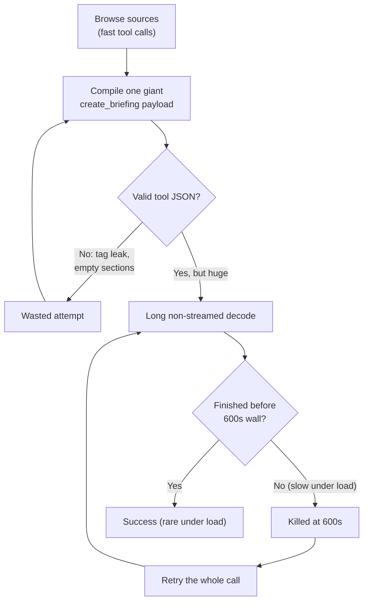
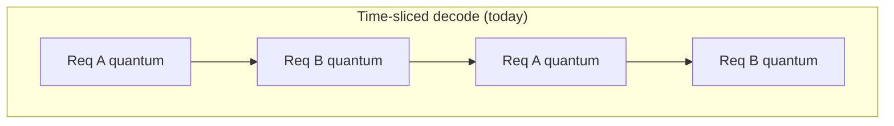
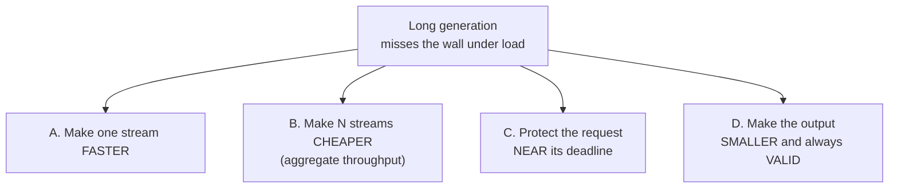
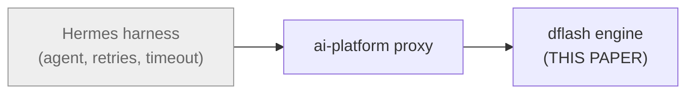
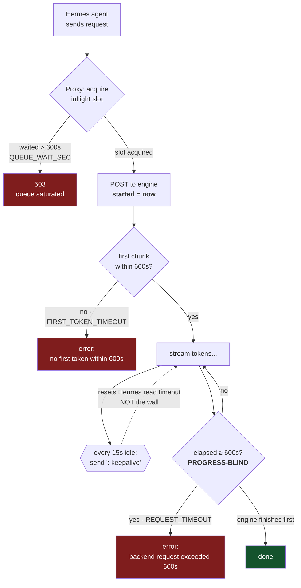
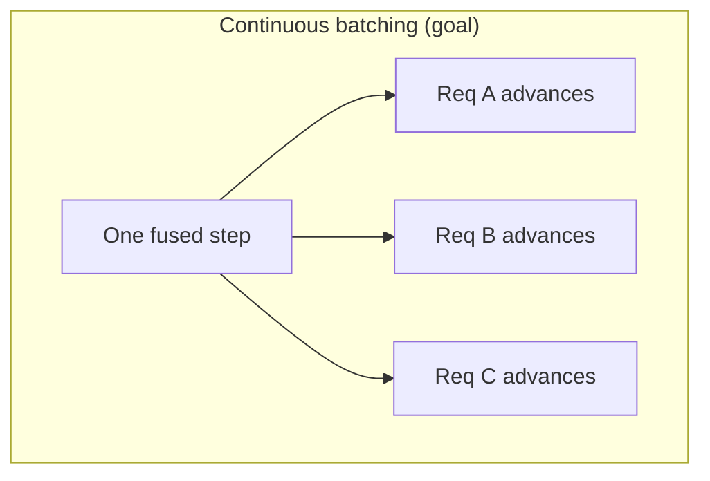
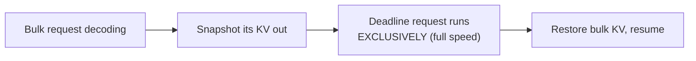
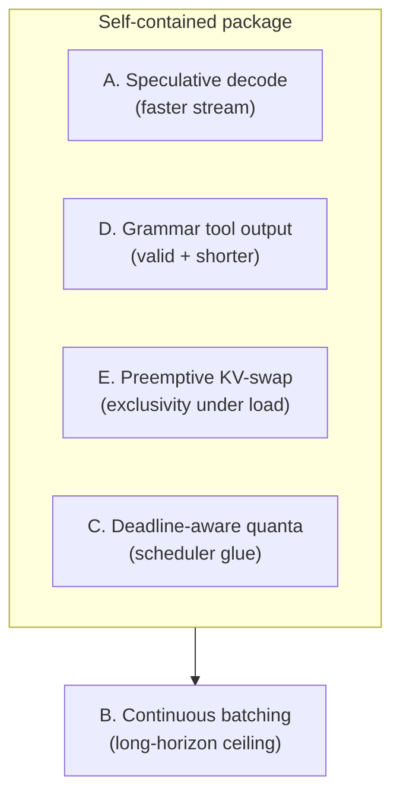
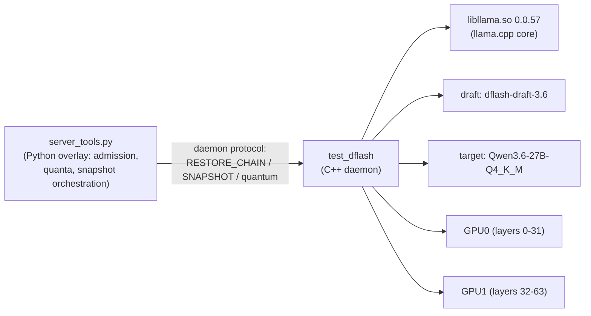

# Surviving the Wall: Engine-Only Paths for Long Generations Under Contention

**Making a single large generation finish inside a fixed request wall on a
shared, multi-slot, layer-split engine — without changing the agent or the job**

*July 2026 — model-runner-v4 / lucebox (dflash) · Qwen3.6-27B on 2×RTX 3090*
*Audience: engineering and operators owning the inference engine*
*Companion papers: [inference-engine-north-star.md](./inference-engine-north-star.md), [whitepaper-efficient-agent-ttft.md](./whitepaper-efficient-agent-ttft.md), [nextgen-multi-request-shared-kv-plan.md](./nextgen-multi-request-shared-kv-plan.md)*

---

## Executive Summary

A recurring production job — the "Daily AI News Digest" cron — fails almost
every day with `backend request exceeded 600s`. It is not a crash, not a
session mix-up, and not an outage. It is a **workload-versus-deadline
mismatch**: one large, non-streamed generation cannot finish inside the fixed
600-second request wall when the engine is simultaneously serving other work.

The engine time-slices decode across live slots, so each request runs at
roughly `1/N` of full speed under `N`-way concurrency. A generation that is
already near the wall when run alone reliably crosses it under load. A
malformed first attempt (a leaked `<tool_call>` fragment that produced an empty
payload) makes it worse by wasting an entire wall-length attempt before the real
one begins.

This paper accepts a hard scope rule: **we may only change the inference
engine.** The agent harness (Hermes) and the job definition (the cron prompt,
its token caps, its retry policy) are off-limits. That rule deletes the tempting
"just make the deadline smarter" fixes, because the deadline is enforced
outside the engine. The engine's only winning move is therefore to **make the
generation actually finish in time** — by decoding faster, by refusing to let
concurrency starve a request that is close to its deadline, and by never
emitting an invalid payload that forces a retry.

We identify five engine-only levers, remove the ones that secretly require the
harness, and recommend a self-contained package —
**speculative decoding + grammar-constrained tool output + preemptive KV-swap
scheduling** — that closes the specific failure without the highest-risk
architectural surgery. Full continuous batching remains the long-horizon
ceiling, not the near-term dependency.

> The diagrams in this paper are **deliberately simplified for understanding,
> not accuracy.** They omit real components and edge cases to make the mental
> model obvious. Treat them as intuition pumps, not architecture references.

> **Read-only engine findings (Jul 18, 2026) — see §11.** A code/runtime pass
> changed two premises of the original draft: (1) the engine is **llama.cpp**
> (`libllama.so.0.0.57`) driven by a custom `test_dflash` daemon, so grammar,
> speculative, and batched-decode primitives exist **upstream**; and (2)
> **speculative decoding is already in production** (draft `dflash-draft-3.6`
> + target `Qwen3.6-27B-Q4_K_M`, ddtree budget 22). Measured decode is
> **~7–9 tok/s under load**, which means the 600s wall caps output near
> **~4,800 tokens even with no contention** — a full briefing exceeds that on
> its own. The dominant lever is therefore raising **tokens/sec** (draft
> acceptance on structured output) and cutting **token count** (grammar),
> with contention removal second. Options are re-graded in §11.

---

## 1. The Motivating Incident

The digest job runs daily. It browses several news sources (each turn is a
quick 5–30s tool call), then calls `create_briefing` **once** with the entire
digest as a large structured payload: narration, body, metrics, and citations
across five categories and 8–15 stories.

That final call is the one that dies. From the captured request dump of the
Jul 17 failure:

| Property | Value |
|---|---|
| Model | `qwen3.6-27b-autoround` (local, `ai.local:8000`) |
| `max_tokens` | 32768 (uncapped) |
| `stream` | none (tool-argument generation, nothing consumed incrementally) |
| Prompt size | ~41K tokens, 30 tool schemas on the wire |
| First attempt | malformed: `<tool_call>` leaked into content → empty `sections` → validation error |
| Retry behavior | 5× at 600s each → one slow generation becomes a 50–98 minute failing job |
| Final error | `backend_timeout` — `max_retries_exhausted` |



The key reading: **the engine had the whole job right up to the last step.**
The failure is entirely inside one generation that is too long to finish in
time when the GPU is shared.

---

## 2. Why It Happens: One Bottleneck, Four Levers

The engine serves multiple requests by **time-slicing** decode — it hands the
GPU to one sequence for a quantum, then the next. With `N` live slots, each
request advances during only about `1/N` of the steps, so its wall-clock time
stretches by roughly `N×`. A generation that barely fits the wall alone will
miss it under load.



Only one sequence makes progress at a time; the others wait. That is the
`1/N` penalty in one picture.

The problem decomposes into **four independent levers**. The elegant fixes push
on more than one at once.



---

## 3. Scope Rule: Engine Only

The stack has three layers. This paper may only touch the bottom one.



That boundary matters because **the 600s wall is enforced above the engine** —
by the agent's client timeout and the proxy's request timeout. So any fix whose
mechanism is "change how the wall is enforced" is out of scope by definition.
The engine cannot negotiate the deadline; it can only beat it.

---

## 3.5 Anatomy of the 600s Wall

"600s" is not one timer. It is **three independent 600s budgets in the
ai-platform proxy** (`services/proxy/alias_proxy.py`), plus a client-side read
timeout in Hermes. Only one of them kills the digest.



**The four clocks:**

| Clock | Where | Starts | Reset by | Trips at | Kills the digest? |
|---|---|---|---|---|---|
| Client read timeout | Hermes (httpx) | each read | **any byte** (token *or* keepalive) | ~100s idle gap¹ | No — keepalives defeat it |
| Queue wait | Proxy | request arrival | — | 600s waiting for a slot | Sometimes (contention → 503) |
| First-token wall | Proxy | stream start (`started`) | — | 600s with no first chunk | Rarely (prefill is fast) |
| **Total wall** | **Proxy** | **stream start (`started`)** | **nothing** | **600s absolute** | **Yes — this is the killer** |

¹ `HERMES_READ_TIMEOUT_RISK_MS = 100000`; keepalives fire every
`KEEPALIVE_INTERVAL_S = 15`s to stay under it.

The enforcement is the top of the proxy's read loop — a pure wall-clock check
that no amount of token progress resets:

```python
elapsed = now - started
if elapsed >= BACKEND_REQUEST_TIMEOUT_SEC:      # 600s, absolute
    error = f"backend request exceeded {BACKEND_REQUEST_TIMEOUT_SEC:.0f}s"
    break
```

**What this truly means:**

1. **Progress-blind, not a stall detector.** A perfectly healthy stream still
   dies at exactly 600s if it needs 601s of decode. Tokens buy time against
   Hermes's read timeout, never against this wall.
2. **Measured from stream start**, so queue wait is a *separate* 600s gate — a
   request can burn ~600s queued *then* ~600s streaming before this fires.
3. **Keepalives are a red herring for this failure** — they keep Hermes from
   hanging up, but the proxy's wall ignores them.
4. **It is a proxy env var** (`BACKEND_REQUEST_TIMEOUT_SEC`), not a harness or
   job change. Raising it is one legal line — but it is a *tradeoff*, not a fix:
   a long request holds a scarce inflight slot longer, worsening
   `QUEUE_WAIT_SEC` saturation for everyone else. Time bought at the cost of
   concurrency. (Guard rail, not the plan — cf. §7's internal clamp.)

---

## 4. Options Removed by the Scope Rule

Traceability — these were real candidates, cut for a specific reason:

| Removed option | Why it violates scope |
|---|---|
| Progress-based / deadline-aware **wall** | The kill decision lives in the harness/proxy timeout, not the engine. |
| "Always stream tool-args to survive the wall" | Only helps if the *client* timeout becomes idle-based — a harness/proxy change. |
| Rewrite the job prompt (fewer stories, best-effort briefing) | Modifies the job. |
| Cap the job's `max_tokens` / reduce retries | Modifies the job/harness. |

The consequence is important and is the spine of the rest of the paper:
**with no way to soften the wall, the engine must make the generation finish.**

---

## 5. Engine-Only Options That Survive

All five live entirely inside model-runner-v4 / dflash.

### A. Speculative decoding — **already deployed; the lever is acceptance**
The engine already runs draft-and-verify: a draft model (`dflash-draft-3.6-q4_k_m.gguf`)
proposes, the target (`Qwen3.6-27B-Q4_K_M`) verifies, via a ddtree with budget 22.
So "add speculation" is not the move. The measured behavior (§11) is the point:
**~3.5–4 tokens committed per verify step, ~15–21% of proposed tokens accepted,
~7–9 tok/s** under load. That acceptance is *low for structured output* — and
briefing/tool-call payloads are exactly the low-entropy, templated text where
acceptance *should* be highest.

The real, engine-only opportunity is to **raise acceptance on structured
generations**: a draft specialized/fine-tuned on the tool-call + briefing
grammar, a larger ddtree budget for these requests, or grammar-aligned drafting
(couples with D). Doubling commit/step on the briefing turn roughly doubles its
tok/s — the single most direct way to move it under the wall.

- Touches: draft model / ddtree config; decode path already supports it.
- Cost: draft VRAM already spent; specialization is training/tuning, not new plumbing.

### B. Continuous (token-level) batching
Advance **all** live sequences in a single fused forward step instead of
handing off quanta. Weights are read once per step; multiple sequences' KV are
batched together.



Highest ceiling, highest effort. The open questions are kernel-level: does the
attention path support ragged batched attention across sequences; can many live
KV blocks stay resident (paged-attention style) rather than the current
snapshot/restore model; how do fused steps micro-batch across the two-GPU layer
split.

### C. Deadline / priority-aware scheduling
The engine assumes a **configured wall** (e.g. an env value; no client input
needed) and allocates quanta with awareness of it: a request approaching the
wall gets a larger quantum or priority so it *finishes* rather than decaying at
`1/N`. Pairs naturally with admission control (queue over 503, already the
house preference) and builds directly on the correlation telemetry the engine
already emits.

### D. Grammar-constrained tool decoding
Constrain sampling to a grammar **built from the `tools` array that is already
in every request** — nothing new from the harness, the schema is already on the
wire. Two wins at once:

- The malformed `<tool_call>`-leak / empty-`sections` attempt becomes
  structurally impossible — removing an entire wasted wall.
- Valid-only tokens mean **shorter, tighter output** → less decode → less wall.

### E. Preemptive KV-swap scheduling
Reuse the existing **snapshot/restore (disk/CPU KV) slots** to *preempt* a bulk
request — swap its KV out so a near-deadline request gets **exclusive** decode,
then resume the bulk one afterward.



This buys single-stream exclusivity — defeating the `1/N` penalty for the
request that must finish — **without** the full continuous-batch kernel rewrite.
It is the pragmatic middle ground between today's time-slicing and option B.

---

## 6. Re-Ranking Under the Constraint

Because the wall can no longer be softened, weight shifts toward the decode
accelerators and contention-removers.

| Option | Kills *this* failure | General stability | Effort | KV-arch surgery |
|---|---|---|---|---|
| D. Grammar tool decode | High | Medium | Low–Med | No |
| A. Speculative decode | High | High | Medium | No |
| E. Preemptive KV-swap | High | High | Medium | Reuses existing snapshot |
| C. Deadline-aware quanta | Med–High | High | Medium | No |
| B. Continuous batching | Medium | Very High | High | Yes |

---

## 7. Recommended Path

A self-contained package that fixes the observed failure without the riskiest
work, plus a clearly separated long-horizon goal.



Because the wall is an **absolute, progress-blind cap** (§3.5), the levers split
cleanly by what they can affect:

- **A and D are the only levers that help a *solo* generation.** The solo pass
  condition is arithmetic: `output_tokens / tok_per_sec < 600`. At ~8 tok/s that
  caps output near ~4,800 tokens no matter what the scheduler does — so the only
  way to fit a full briefing is to raise tok/s (A) or cut tokens (D).
- **C and E are contention-only.** They win back first-token latency and a fair
  GPU share under load, but once a request *has* the GPU, they cannot beat the
  absolute cap. They keep the solo win from evaporating under concurrency; they
  do not create it.

- **A + D** is the innovative core, and A is now a *tuning* target rather than a
  greenfield build: speculation already runs at ~4 commit/step and ~8 tok/s, so
  a draft specialized on the tool-call / briefing grammar (plus grammar-aligned
  drafting from D) raises acceptance *and* guarantees validity — faster *and* no
  wasted attempt. This is the highest-leverage move because the turn is over the
  wall even solo.
- **E** ensures concurrency cannot starve the generation that must finish, reusing
  the existing live-KV snapshot primitive.
- **C** is the cheap scheduler layer (already in our Python overlay) that ties A
  and E together and enforces the engine-internal deadline.
- **B** stays the ceiling — pursued deliberately, not as a prerequisite. Note
  (corrected, §11.6): the unused `run_qwen35_daemon` is **not** a head-start for
  B — it is a refactor of the *same* time-sliced, one-slot-per-quantum design.
  Continuous batching remains net-new work regardless of which loop hosts it.

**Build order (data-backed, §10.1):** the solo replay resolves the sequencing.
0. **Overlay-repair (no rebuild, shipped — see §11.7).** Before any C++ work,
   harden the Python overlay's tool-call parser so malformed structure is
   *recovered* rather than leaked or silently dropped. This does not constrain
   decoding, but it removes the client-visible failure (empty replies / literal
   `<tool_call>` text) for the whole malformed-output class with a container
   restart, not a CUDA rebuild. It is the cheapest, most reversible first move.
1. **Grammar-Constrained Decoding** — fixes the *deterministic* failure at its
   source (malformed `<tool_call>` reproduced solo/idle) and cuts token count.
   2. **Draft-Acceptance Tuning** — raises the measured 8.2 tok/s ceiling;
   grammar-aligned drafting should accept far above today's 17.2%, so the two
   compound. 3. **Preemptive KV-Swap** then **Deadline-Aware Scheduling** —
   protect the solo win once daily contention returns. **Continuous Batching**
   stays the long-horizon ceiling.

A blunt seatbelt worth naming but not relying on: an **internal generation
clamp** so a runaway 32768-token request cannot consume a whole wall. It risks
truncating a legitimate payload, so it is a guard rail, not a fix.

---

## 8. Arithmetic (Now With Measured Numbers)

Measured on ai.local by replaying the **actual failed digest request** against an
**idle** engine (§10.1, req=340): **8.2 tok/s** decode, **~209 tok/s** prefill,
draft acceptance **17.2%** (commit/step 3.74) — *with speculation already
active*. Idle is not faster than loaded here; ~8 tok/s is simply this model's
rate on 2×3090 with layer-split + 17% draft acceptance.

Because the 600s wall is an **absolute cap that also has to pay for prefill**
(§3.5), the real output ceiling is lower than a naïve `600 × 8.2`:

```text
cold start:  ~150 s prefill (~31k-tok context @ 209 tok/s)
             → ~450 s decode × 8.2 ≈ 3,700 output tokens before the wall
warm cache:  ~74 s prefill (16k cached, 15k fresh — as measured)
             → ~526 s decode × 8.2 ≈ 4,300 output tokens before the wall
```

A full briefing — narration + body + metrics + citations across five categories
and 8–15 stories — *exceeds* ~3,700–4,300 output tokens. The production request
asked for up to 32,768 tokens and was killed still generating; at 8.2 tok/s that
budget alone is **~4,000 s (67 min)** of decode. So the killer turn is **far
over the wall even solo**, and contention (`1/N`) only widens the miss and makes
it a near-daily event.

Take a ~6,000-token briefing:

| Scenario | Effective rate | Est. wall time | Fate at 600s |
|---|---|---|---|
| Solo, today (spec on, ~8 tok/s) | ~8 tok/s | ~750s | **misses even solo** |
| 3-way contention, today | ~1/3 → ~2.7 tok/s | ~2,200s | **misses badly** |
| + higher draft acceptance (2× commit/step) | ~16 tok/s | ~375s | survives solo |
| + preemptive exclusivity (no 1/N) | full-speed under load | ~375s | **survives under load** |
| + grammar (fewer tokens, no wasted retry) | fewer tokens, 0 wasted attempts | further reduced | **survives with margin** |

Directionally: because we start **over the wall even solo**, the plan must
*first* raise raw tok/s (acceptance) and cut token count (grammar); removing
`1/N` contention (E/C) is what keeps it under the wall once the daily overlap
returns. All three compound.

---

## 9. Feasibility Verdicts (from the read-only pass)

| # | Question | Verdict | Basis |
|---|---|---|---|
| A | Speculative present? | **Already deployed** | ddtree draft+target in the launch args; acceptance telemetry in logs |
| D | Grammar hook available? | **Needs-work (plumbing)** | GBNF is upstream in llama.cpp; must pass a grammar through the custom daemon protocol + install in the sampler |
| E | Live-KV snapshot for preemption? | **Feasible (primitive exists)** | `snapshot_live_prefix` snapshots the daemon's current GPU KV; `/v1e` preemption tracking already present |
| C | Deadline-aware quanta? | **Feasible (overlay-level)** | quantum is chosen in `target_cache_admission.schedule_quantum_for` and passed per-admit; add deadline input |
| B | Batched multi-seq decode? | **Net-new work; no daemon shortcut** | Both daemons (legacy inline and `run_qwen35_daemon`) run one slot per quantum with snapshot/restore — same `1/N` model. Batched `llama_decode` across seq_ids per step must be built, plus layer-split + tool-split reconciliation. See §11.6. |

Net: none of the five require a from-scratch CUDA kernel. A is a *tuning* problem,
C is *ours already* (Python overlay), E *reuses an existing primitive*, D is
*upstream capability + protocol plumbing*, and B is *the real build* — net-new
batched decode, with **no** head-start from the modern daemon (§11.6).

---

## 10. Measurement Plan

The correlation logging already deployed (`DFLASH_CORR_LOG`) is the evaluation
harness. From it we can compute, per request:

- true decode tokens/sec (solo vs. under N-way load),
- `1/N` penalty as a function of live slots,
- fraction of wall consumed by the final structured generation,
- rate of malformed-then-retried tool calls (the grammar target).

Success criteria for the package:

- Zero malformed-tool-call retries (Grammar-Constrained Decoding lands).
- The digest's final generation completes with margin under the wall at the
  observed daily concurrency (Draft-Acceptance + KV-Swap + Deadline-Aware land).
- No regression in interactive TTFT for co-resident requests.

### 10.1 Results — solo replay of the failed digest (Jul 18, 2026)

Tooling: `scripts/digest_wall_scorecard.py` (read-only) replayed the recorded
failing request
(`request_dump_cron_9e2114f61177_20260718_121513…json`) directly against the
**idle** engine (`model-runner-v4-lucebox:8080`, bypassing the proxy wall),
capped at 1,000 output tokens. Authoritative rates read from the daemon log
(req=340).

| Metric | Value | Source |
|---|---|---|
| Decode rate (solo, idle) | **8.2 tok/s** | `decode tokens=512 time=62.8s speed=8.15 tok/s` |
| Prefill rate | **~209 tok/s** | 15,401 fresh tokens in 73.8s (16,050 restored in 0.23s) |
| Draft acceptance | **17.2%**, commit/step 3.74 | `137 draft steps, accepted=376/2192` |
| Output ceiling in 600s | **~3,700 (cold) – 4,300 (warm)** tokens | §8 arithmetic |
| Malformed tool output | **Yes — reproduced solo/idle** | first_text "Excellent! I now have…" + literal `<tool_call>` leaked into content |

Two conclusions fall straight out and set the build order:

1. **Grammar-Constrained Decoding first.** The malformed `<tool_call>` leak is
   *deterministic even solo and idle* — it is not a contention artifact. In
   production it burns a whole 600s wall per occurrence (one of two attempts).
   Grammar both eliminates that failure mode and strips the prose preamble +
   enforces compact JSON, **cutting the token count** decode must chew through.
2. **Draft-Acceptance Tuning second.** 17.2% acceptance / 3.74 commit-per-step
   is low; raising it lifts the 8.2 tok/s ceiling directly. Structured output is
   highly predictable, so a grammar-aligned drafter should accept at a much
   higher rate — the two levers **compound**.

Contention levers (Deadline-Aware Scheduling, Preemptive KV-Swap) remain
second-order: we are over the wall *before* any contention, so they protect the
solo win rather than create it.

> Tooling note: `server_tools.py` returns the generation **buffered** (all tokens
> flushed in one burst after the full compute), so wall-clock decode timing from
> the client is meaningless — the scorecard now detects this and defers to the
> daemon's `decode_tok_s`. Any future rate measurement must read the daemon log,
> not client inter-chunk timing.

---

## 11. Read-Only Engine Findings (Jul 18, 2026)

A code + runtime pass on ai.local (`model-runner-v4-lucebox`). All read-only.

### 11.1 Architecture



- **Core:** llama.cpp (`libllama.so.0.0.57`, `deps/llama.cpp`). Grammar (GBNF),
  speculative, and batched-decode are upstream primitives.
- **Daemon:** custom `test_dflash`, launched `--daemon --fast-rollback --ddtree
  --ddtree-budget=22`, driven over a pipe with the legacy inline protocol
  (`DFLASH_LEGACY_DAEMON=1`). A refactored path (`run_qwen35_daemon`) exists but
  is **not** used — and is not a batching upgrade (§11.6).
- **Layer split:** `--target-gpus 0,1 --target-layer-split 32,32 --peer-access`
  across 2×RTX 3090.

### 11.2 Speculative decoding is already in production

Launch args pair a draft (`dflash-draft-3.6-q4_k_m.gguf`) with the target and a
ddtree of budget 22, `--draft-feature-mirror`. Daemon logs emit per-turn:

```text
[daemon] [target-split-dflash] decode tokens=128 time=14.22 s speed=9.00 tok/s
[daemon] [target-split-dflash] 31 draft steps, accepted=97/496 (19.6%), avg commit/step=4.13
```

| Metric (under production load, 24h) | Value |
|---|---|
| Effective decode speed | **~7–9 tok/s** (one 15 tok/s outlier) |
| Draft tokens accepted / proposed | **~20.8% overall** (samples 15–21%) |
| Avg tokens committed per verify step | **~3.5–4.1** |

Interpretation: speculation is working but acceptance is **low for structured
output**, where it should be highest — that gap is the tuning opportunity in A.

### 11.3 Primitives that de-risk the plan

- **Live-KV snapshot exists** — `snapshot_live_prefix` issues `SNAPSHOT <slot>`
  on the daemon's *current* GPU KV (not just prefix boundaries). Basis for E.
- **`/v1e` preemption tracking exists** — `handler_reliability` already "tracks
  in-flight `/v1e` work so `/v1` can preempt it" (from L0). Extends toward E.
- **Quantum scheduling is in our overlay** — `target_cache_admission.schedule_quantum_for(lane, scoped)`
  picks the quantum and passes it per-admit on the RESTORE_CHAIN line. Basis for C.

### 11.4 Consequence for the wall

At ~8 tok/s, 600s ≈ 4,800 tokens. The briefing turn is over the wall **even
without contention**, which is why it fails almost daily and why raising tok/s
(A) and cutting tokens (D) lead the plan.

### 11.5 Follow-up probe results (Jul 18)

A second read-only pass tried to settle grammar (D) and the modern daemon (B):

- **Grammar (D):** No grammar/GBNF/`response_format` reference in the Python
  overlay, none in the daemon command protocol, and no matching strings surfaced
  in the `test_dflash` binary. GBNF exists in `libllama` upstream, but **this
  daemon build does not appear to expose or use it.** → D is confirmed as real
  C++ work (install a grammar sampler + plumb a grammar param through the custom
  protocol), **not a config toggle.**
- **Modern daemon (B):** From the deployed artifacts alone, `run_qwen35_daemon`
  appeared only in an entrypoint comment — the container ships **built artifacts
  only** (`test_dflash` binary + `dflash-build/`), not engine source. This was
  the blocker that motivated bringing the source in as a submodule (§11.6).

**Then:** the `lucebox-hub` source was added as a submodule
(`lucebox-hub-src/`, pinned to the deployed commit `c0deaf7`), which settled
both questions directly from source. See §11.6.

### 11.6 Source-confirmed findings for B and D (submodule pass)

With `lucebox-hub-src/` in place, the daemon source resolves the two open items.

**`run_qwen35_daemon` is a refactor, not a batching engine — corrects earlier
speculation.**

- It is a ~30-line wrapper (`server/src/qwen35/qwen35_daemon.cpp`) that builds a
  `Qwen35Backend` and calls the **generic** `run_daemon` loop
  (`server/src/common/daemon_loop.cpp`).
- That generic loop uses the **same scheduling model** as the legacy path:
  `run_one_quantum(slot_id)` activates **one slot, runs a quantum, then
  switches** (`LiveRequestState requests[n_slots]`,
  `activate_target_cache_slot`, `SCHED_DRAIN`). It does **not** advance multiple
  sequences per GPU step — the `1/N` penalty is unchanged.
- It is **gated to single-GPU**: `test_dflash.cpp` dispatches to it only when
  `daemon_mode && !legacy_daemon && target_gpus.size() <= 1`. Production runs
  2-GPU layer split, so it is never eligible today.
- It is disabled anyway because it **does not implement the legacy tool-split
  protocol** (`SNAPSHOT_THIN <slot> <kv_start> <kv_end>`, the `[snap] inline
  slot=` ack) that `server_tools.py` relies on — hence `DFLASH_LEGACY_DAEMON=1`.

**Consequence:** `run_qwen35_daemon` is a code-quality path (backend
abstraction + shared loop), **not** a head-start for continuous batching.
Option B is net-new work — batched `llama_decode` across seq_ids per step —
*plus* layer-split support *plus* tool-split/snapshot reconciliation, on either
loop. B's effort estimate rises accordingly.

**Grammar (D):** confirmed as C++ work — no grammar seam in the daemon protocol
today; a grammar sampler must be installed in the backend and a grammar param
plumbed through the command protocol. The GBNF primitive lives in the custom
llama.cpp fork (`Luce-Org/llama.cpp-dflash-ggml`, a nested submodule not yet
initialized), so end-to-end confirmation of the sampler seam is the one
remaining read.

**Confidence:** high on both (read directly from the deployed commit's source).

### 11.7 The tool-hint machinery is on the *unused* server path (decisive for D)

The submodule pass surfaced a real tool-call constraint mechanism — and confirmed
it does **not** touch production:

- **Two server binaries exist.** `dflash_server` (native C++ HTTP server,
  `src/server/http_server.cpp`) and `test_dflash` (the daemon,
  `src/common/daemon_loop.cpp`). `entrypoint-dual-gpu.sh` selects the daemon +
  Python overlay path when `DFLASH_TOOL_SPLIT_ENABLED=1` (production), and the
  native server otherwise.
- **The hint machinery lives only in `dflash_server`.** `src/server/tool_hint.cpp`
  (`ToolHintGenerator` / `HintStateMachine`) pre-tokenizes the predictable
  structural tokens of a tool call and injects them as spec-decode draft
  overrides. `http_server.cpp` arms it from `req.tools` + `req.tool_choice`.
- **The daemon protocol carries none of this.** `daemon_loop.cpp` parses only
  slot prefixes, sampler tails, and snapshot/restore commands — there is **no**
  `tools`, `tool_choice`, or hint field. So in production (`server_tools.py` →
  `test_dflash`) the hint generator is unreachable.
- **Even where it exists, it is empty under `auto`.** `ToolHintGenerator::build_hint`
  returns an empty hint for `tool_choice: "auto"` (and `"none"`). Agent traffic is
  `auto`. So *no* path constrains the case that actually fails today — auto-arming
  on the emitted `<tool_call>` anchor is net-new work everywhere.
- **The backend decode loop already accepts a hint pointer.**
  `qwen35_backend.cpp` injects `hint_tokens` into the spec-decode draft slots.
  This is the hard part and it is done; the gap for D is (a) exposing a hint/grammar
  field through the daemon protocol, (b) arming it under `auto` at the anchor
  (which requires resolving the model-chosen function name at runtime), and
  (c) `server_tools.py` sending tools + stitching the forced opener back for the
  parser. All three require a rebuild the Mac cannot do (CUDA + nested
  `deps/llama.cpp` submodule).

**Consequence — the no-rebuild reliability fix.** Because production's only
in-path lever is the Python overlay, the malformed-output *symptom* is fixed
there without any C++: harden `parse_tool_calls` in `server_tools.py` so it
(1) strips an orphan `<tool_call>` opener when a call is recovered from an
unclosed block (the "literal `<tool_call>` leaked into content" case), and
(2) preserves a malformed/truncated block as visible content instead of
consuming it into nothing (the "empty reply" case). Both are covered by
`test_parse_tool_calls.py` and validated stdlib-only. This is step 0 in §7's
build order: it removes the client-visible failure with a container restart,
while the durable decode-time guardrail (D) remains the source-level fix.

**Confidence:** high (read from the deployed commit's source; parser fix
unit-tested).

---

## Appendix: Glossary

| Term | Meaning |
|---|---|
| Wall | Fixed request deadline (600s) enforced above the engine. |
| `1/N` penalty | Each of `N` time-sliced requests runs at ~`1/N` speed. |
| Quantum | The decode budget one sequence gets before handoff. |
| Speculative decoding | Draft proposes tokens, target verifies in bulk. |
| ddtree | Draft "tree" of candidate continuations (budget-bounded) verified per step. |
| Commit/step | Tokens accepted per verify step; the speculative speedup factor. |
| Continuous batching | One fused step advances all live sequences. |
| KV-swap preemption | Snapshot a request's KV out to give another exclusivity, then resume. |
| Grammar-constrained decoding | Restrict sampling to structurally valid tokens (from the request's tool schemas). |

---

*Scope reminder: every option in §5–§7 is implementable inside
model-runner-v4 / dflash alone. No change to the Hermes harness or to any job
definition is required or assumed.*
